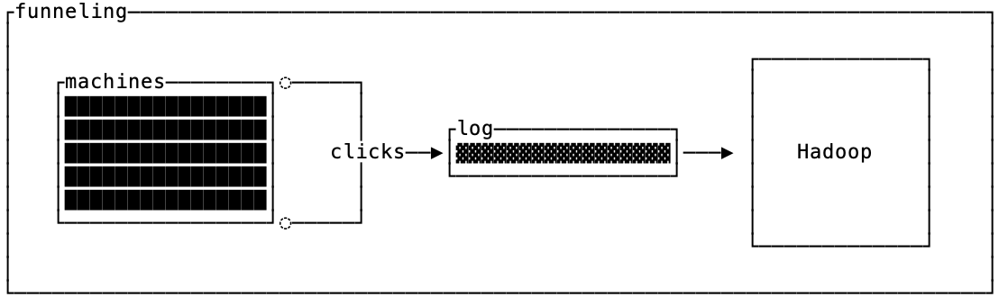
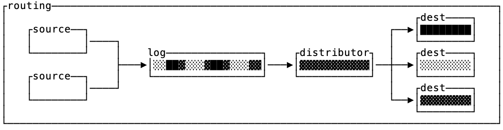
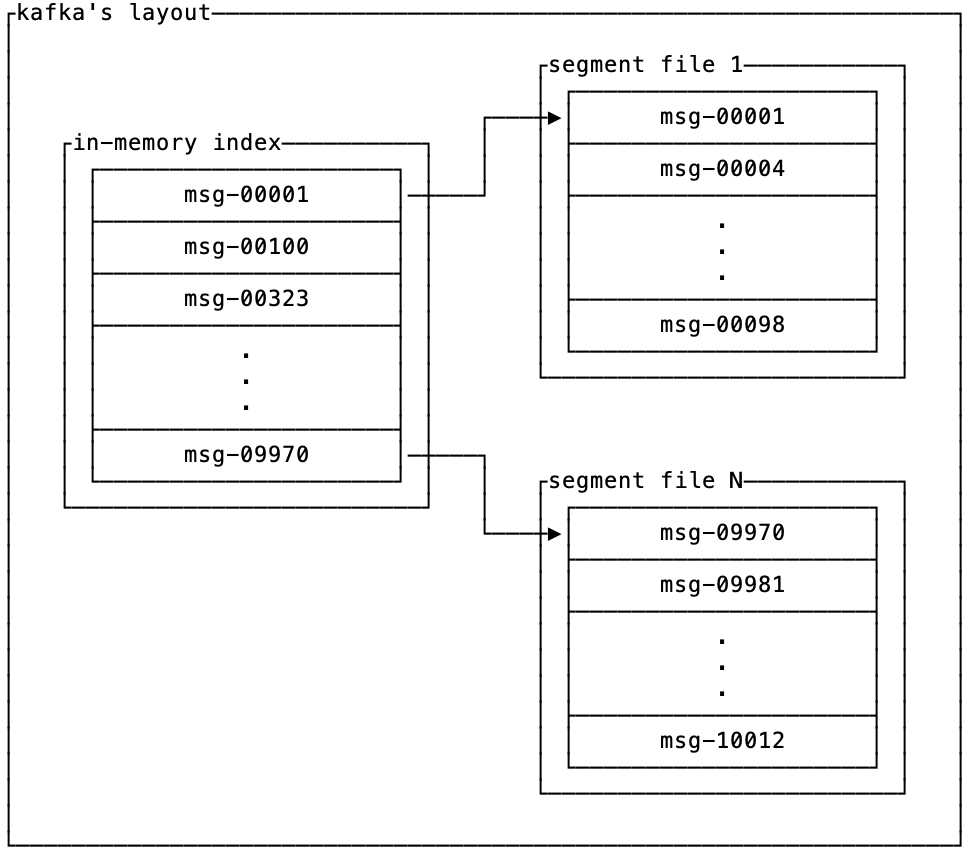

import LatencyVsCardinality from "../../../components/charts/LatencyVsCardinality.astro";
import LatencyVsIngest from "../../../components/charts/LatencyVsIngest.astro";
import RangeVsRandomSharding from "../../../components/charts/RangeVsRandomSharding.astro";
import CostBreakdown from "../../../components/charts/CostBreakdown.astro";

## TL;DR

Opendata _Log_ maintains millions of individually keyed, ordered logs and
scales to tens of thousands of active readers on a single instance. It is
MIT-licensed, built directly on Object Storage, and deployed as a single Rust
binary. 

Create your first logs in 2 minutes with our quickstart:
https://www.opendata.dev/docs/log/quickstart 

## There is No Goldilocks Log

In late 2013, Jay Kreps published one of the [most influential blog posts](https://engineering.linkedin.com/distributed-systems/log-what-every-software-engineer-should-know-about-real-time-datas-unifying) in data engineering. He explained why *The Log* is the universal building block underneath nearly all data systems. It can replicate a state machine across a network, feed a firehose of data into downstream systems, and serve as efficient storage for real-time processing.

He was correct about the abstraction, but incorrectly assumed that this single abstraction could also be implemented by a single system (called [Kafka](https://kafka.apache.org/)).

A decade of working on logging systems has taught us that logging, as it turns out, is split into two types:

| Type | Description | Examples |
| --- | --- | --- |
| Funneling | Collecting data from high-cardinality sources and coalescing them onto a low-cardinality pipe. | Telemetry pipelines, clickstream collection, warehouse dumps |
| Routing | Delivering events from addressable sources to addressable destinations. | Messaging, feeds, agent traces |

Both of these patterns require a durable log, but they have quite different nonfunctional characteristics that make a system designed for one a poor fit for the other. Some use cases just need the biggest, cheapest pipe they can get. Others need to scale to the millions of small logs.

### Funnels

When Kafka was released in 2011, fifteen years ago, [it was built to funnel telemetry](https://pages.cs.wisc.edu/~akella/CS744/F17/838-CloudPapers/Kafka.pdf) (clickstream, page views, metrics) data from all of LinkedIn's servers to Hadoop and/or an online metrics database.



An intriguing similarity across the initial Kafka use cases at LinkedIn was that messages sent to Kafka were keyless. In fact, the initial Kafka implementation discarded the partitioning key after computing a partition, leaving only the payload on storage (it wasn't until later that Kafka supported keys and compaction).

In the context of funneling, this isn't surprising. If what you want is to shuttle data from source to destination then a simple pipe that's optimized for well-balanced throughput is ideal.

### Routers

The other use case for logs is routing, which is often seen in messaging applications, feeds and microservice communication. It takes events from input sources and delivers them to specific, addressed destinations or records them for future replay.



The defining characteristic of routers is that destinations are only interested in a particular subset of keys. If you think of the funnel as a dumb broker, then routers need smart logic to distribute the messages in the log to their respective destinations.

## Why Kafka is an Excellent Funnel, But a Bad Router

We like to reason about storage systems in terms of [read, write and space amplification](https://www.bitsxpages.com/p/understanding-lsm-trees-via-read). The only way to improve all three in a system is to restrict the usage pattern.

When the engineers at LinkedIn designed Kafka, they restricted the API to make it particularly well suited as a funnel with low write amplification. Since data is written to disk via append-only, immutable files which are only cleaned up wholesale when they fall out of retention, the write amplification `α_write` is ~1x.



The consequence of this low write-amplification design is that reads are heavily restricted. The only read API provided is to scan the data in the order that it was written, but if that's what you want then your read amplification `α_read` is also 1x.

Routers need a different access pattern on the underlying log. Instead of one massive log, routers want to store hundreds of thousands or even millions of individual logs.

Since Kafka partitions are isolated from one another, it's not feasible to store each routing log in its own partition. This means that to find a *specific* message by key in a funnel like Kafka, your read amplification is the ratio of the entire partition size divided by the size of the record:

```
              |partition|
  α_read  =  ─────────────
               |record|
```

This is nearly worst case read amplification, and makes it impractical to use Kafka as a router.

## The right primitive for Routing

Today we're announcing OpenData *Log*, a superior mechanism for the Routing log use cases (see [OpenData Buffer](https://www.opendata.dev/blog/buffer-ha-pipelines-without-kafka) for a [better](https://www.opendata.dev/blog/ingesting-1gbps-logs-to-clickhouse) alternative to Kafka for funneling use cases).

*Log* is an MIT-Licensed, object-native, key-oriented log built on [SlateDB](https://slatedb.io/). Breaking that down, in reverse:

1. **Key-Oriented**: Unlike Kafka, *Log* organizes data by key instead of topic-partition. You're encouraged to have hundreds of thousands to millions of keys on a single log node.
2. **Object-Native**: The only requirement for durability is Object Storage. This makes it strongly consistent and absurdly durable.
3. **MIT-Licensed**: It's open source and made for hosting yourself.

The first point alone makes Log uniquely different from Kafka, and better suited for Routing. The next two points are what make it good infrastructure and a solid investment for the long-term.

### Keys, not Topic-Partitions

*Log* allows you to read ordered records for a specific key, even if the key cardinality is high:

```rust
let log = LogDb::open(...);

// Scan user-123's log
let mut iter = log.scan(Bytes::from("user-123"), ..).await?;
while let Some(entry) = iter.next().await? {
	println!("seq={}, value={:?}", entry.sequence, entry.value);
}
```

Notice that there's no partition in the parameters for `log.scan()`, you address the log by the key and get the values in return.

For Routing use cases, partitioning is a [poor data model](https://www.morling.dev/blog/what-if-we-could-rebuild-kafka-from-scratch/). Instead, the right level of abstraction is a "key" that can support orders of magnitude more values than Kafka can partitions. See how they compare:

| | Partitions (Kafka) | Keys (*Log*) |
| --- | --- | --- |
| **Point reads** | Finding the values for a specific key requires a needle-in-a-haystack scan of the whole partition to find one key's data | Individual keys can efficiently be scanned by prefix on an LSM index |
| **Isolation** | One problematic key causes head-of-blocking for an entire partition. | Position metadata can be tracked per key so poison-pill message effects are localized |
| **Rescaling** | Changing partition counts is a nightmare that requires arbitrary amounts of data shuffles and disrupts all consumers. Hot partitions are hard to work around. | Keys are assigned with range partitions, no consumer offsets need to be changed when splitting and merging *Log*. Readers can scale to the individual key granularity. |

To support this, *Log* is designed as a segmented LSM tree keyed by `(key, sequence)` and segmented by sequence ranges.

If you're not familiar with LSM trees, the ten-second version is that they are a data structure that stores recent data as a log and compacts older data into a sorted array (if you want the 10 minute version, [read this post](https://www.bitsxpages.com/p/understanding-lsm-trees-via-read)).

In practice, this architecture means you can append new data quickly and still access old data efficiently with a binary-search. The result is that *Log* can support millions of independent keyed logs without increasing the latency for fetching data for a specific log.

This chart below (and all other charts) demonstrates this with real traffic on an `m5n.xlarge` instance type against AWS S3 and varying the workload. Event distribution was randomly sampled by key:

<LatencyVsCardinality />

The "segmented" part of the architecture is how *Log* handles efficient expiration of data. Each segment is a full LSM tree which can be independently compacted. Since a range of sequence numbers maps cleanly to a time interval, older LSM trees can be fully dropped when they no longer need to be retained.

Conceptually, it looks like this where old segments have the data cleanly sorted by key while the newer ones may interleave keys but are sorted by sequence number:

```
┌──────────────────┐    ╔═Log═══════════════════════════════╗
│ scan(key1, 1330) │    ║                                   ║
└──────────────────┘    ║ ┌seq [0-999]────────────────────┐ ║
          │             ║ └───────────────────────────────┘ ║
          │             ║                                   ║
          │             ║ ┌seq [1000-1999]────────────────┐ ║
          │             ║ │   ┌─────────────────────┐     │ ║
          │             ║ │   │  key1@1002 : val11  │     │ ║
          │             ║ │   │ ┌─────────────────┐ │     │ ║
          └─────────────╬─┼───┼▶│key1@1499 : val13│ │     │ ║
                        ║ │   │ │key1@1540 : val14│ │     │ ║
                        ║ │   │ └─────────────────┘ │     │ ║
                        ║ │   │  key2@1422 : val23  │     │ ║
                        ║ │   └─────────────────────┘     │ ║
                        ║ └───────────────────────────────┘ ║
                        ║               ...                 ║
                        ║ ┌seq [current]──────────────────┐ ║
                        ║ │ ┌───────────────────────────┐ │ ║
                        ║ │ │     key1@9100 : val31     │ │ ║
                        ║ │ │     key2@9101 : val32     │ │ ║
                        ║ │ ├───────────────────────────┤ │ ║
                        ║ │ │     key1@9102 : val33     │ │ ║
                        ║ │ │     key2@9103 : val34     │ │ ║
                        ║ │ └───────────────────────────┘ │ ║
                        ║ └───────────────────────────────┘ ║
                        ╚═══════════════════════════════════╝
```

For the full details on the storage implementation, check out the [RFC on GitHub](https://github.com/opendata-oss/opendata/blob/main/log/rfcs/0001-storage.md).

### Scaling without Partitions

While partitions are a suboptimal data modeling concept, some type of data distribution is a requirement for scaling out beyond a single machine. The first strategy available for scaling *Log* horizontally is deploying multiple readers. You can spin up as many read replicas as you want since data is pulled directly from S3. 

Deploying readers that are scoped to a single target key range has the extra benefit of improving the cache locality of reads, thus reducing read amplification. As opposed to hash/random partitioning, queries for keys that are lexicographically proximal on a range-scoped reader means it’s likely a cold miss will pull data from object storage that will be subsequently read by another client that queries the same reader (and vice versa, you don’t thrash the cache with blocks from other ranges).

<RangeVsRandomSharding />

*Log*’s architecture builds on SlateDB and thus inherits the ability to scale out and in without shuffling data. You can split a node with a metadata-only operation. Old data remains on object storage untouched until it eventually is compacted, codifying the split operation.

The consequence of this is that rescaling operations are nearly transparent to consumers. You can point them to a new *Log* instance and they can resume from the same exact offset they left off.

If you’re curious about the details [read the docs](https://slatedb.io/docs/design/clones/) to get a good grip on how this mechanism works.

### Cost

*Log* inherits some of the excellent properties of object storage in its operational costs. There are too many variables in workloads to come up with an exact cost estimate for your workload, but to ground some estimates we were able to ingest nearly 100 MB/s on a single `m5n.xlarge` node (no concurrent reads). When ingesting 20 MB/s in order to push reads, we were able to sustain 50,000 concurrent followers tailing their own keyed logs with an 8GB cache and 1 million keys at &lt;50ms p50 latency.

<CostBreakdown />

Since reader nodes scale linearly, you can increase your read throughput by adding readers. Our particular configuration flushed to S3 approximately every 2-3s, though you can configure write-ahead-logging to get faster durability guarantees at the cost of additional S3 `PUT` requests.

### Tradeoffs

There are a few decisions we made to get *Log* to the point where it can process high cardinality keys and nothing comes for free. In particular, the poll latencies scale with the rate of ingestion. Increased ingestion rates cause the cache to evict hot data before compaction has the opportunity to collocate keys for efficient querying.

<LatencyVsIngest />

The workaround to this, discussed above, is scoping read replicas to smaller ranges to avoid thrashing the cache with blocks that contain data from other ranges.

In addition *Log* inherits the limitations of object storage latencies, but in practice you can get p50 and p99 poll latencies of ~30ms and ~300ms respectively with 25 MiB/s of throughput.

Finally, *Log* does not track consumer offsets directly. This separation of metadata and data allows for more flexible deployment mechanisms, and we recommend you use a Key-Value store like SlateDB for offset tracking on the consumer.

## Get Started Today

*Log* is MIT-licensed and available today as part of [OpenData](https://github.com/opendata-oss/opendata/) and you can run through the [quickstart](https://www.opendata.dev/docs/log/quickstart) in a couple of minutes.

Find us on [Discord](https://discord.gg/2Awkh6YVpP) for questions and, if *Log* is useful to you, star it on [GitHub](https://github.com/opendata-oss/opendata/).
