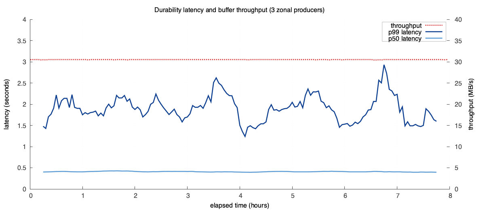

> **tl;dr** by forgoing the Kafka protocol, you save a bunch of money.

Apache Kafka lists many [use cases](https://kafka.apache.org/uses/) on its website, but one of the (if not the most) common use case is shipping data to a database or warehouse. Nearly every database that ingests event data, whether it be ClickHouse or Elastic or DeltaLake, ships with native Kafka ingestion.

This pattern is popular because it builds resilience into your system architecture. Decoupling producers and consumers of data gives a natural place to accumulate backpressure and prevent downtime in the database from taking down your applications.

The price of this resilience is operating (or paying for) an additional complicated distributed system.

Today we're announcing an MIT-licensed library, OpenData *Buffer*, to make that additional system braindead simple and cheap. True to its name, Buffer is a stateless library that implements a protocol for buffering high throughput data on object storage by separating data files and metadata management.

For $90/mo, we ran a benchmark pushing ~30 MiB/s of metrics data via *Buffer*. Using public pricing calculators, the equivalent Kafka service cost roughly [$1,300/month](https://www.warpstream.com/pricing) for managed WarpStream and [$8,500/month](https://2minutestreaming.com/tools/apache-kafka-calculator/) for self-hosted Apache Kafka.

| Service | MiB/s | Cost / month |
| --- | --- | --- |
| OpenData Buffer | 30 | $90 |
| WarpStream | 30 | $1,300 |
| Self-hosted Apache Kafka | 30 | $8,500 |

## Kafka's problem & why *Buffer* is not a log

The Kafka protocol solves two problems really well:

1. it stores ordered data durably with optional transactional semantics, and
2. it tracks consumption so downstream systems can collaboratively process the log.

The inconvenient truth about these two problems is that they are core distributed system concerns. Multi-participant transactions and group coordination are intrinsically hard problems, something which the OpenData contributors are quite familiar with having built these protocols in Apache Kafka over the past decade.

But while these features are necessary for some use cases, they are not relevant to many.

Telemetry and event data are textbook examples of systems that need neither transactional produce nor strict ordering. A log message or a measured metric sample does not have a direct causal relationship with other data that is ingested into the downstream system.

This means *Buffer* can be orders of magnitude simpler, and therefore cheaper, than a fully-featured log. Instead, it solves only one problem: it enables usage of object storage as a moderately low-latency buffer between two systems by defining a simple protocol to batch events into files and coordinate metadata over a manifest.

### Architecture

*Buffer* tracks metadata and data separately, both directly in object storage. The data files are append only to support high-throughput ingestion and the metadata is stored in a single file to support atomic compare-and-set operations.

```
╭───────────────────────────opendata buffer architecture───────────────────────────╮
│                                                                                  │
│                                                                                  │
│                         ╔═object storage════════════╗                            │
│                         ║  ┌─────────────────────┐  ║░                           │
│  ╔═══════════════╗      ║  │                     │  ║░    ╔═sink database════╗   │
│  ║ ingestor-az-1 ├──┐   ║  │ data/01J54R3.batch  │  ║░    ║                  ║   │
│  ╚═══════════════╝  │   ║  │ data/01XY3K5.batch  ├──╫────read───────┐        ║   │
│                     │   ║  │ data/01Z90UX.batch  │  ║░    ║         │        ║   │
│                     ├───▶  │                     │  ║░    ║  ┌──────▼──────┐ ║   │
│  ╔═══════════════╗  │   ║  └─────────────────────┘  ║░    ║  │  collector  │ ║   │
│  ║ ingestor-az-2 ├──┘   ║  ┌────────────────────┐   ║░    ║  └──────┬──────┘ ║   │
│  ╚═══════════════╝      ║  │      manifest      ◀───╫────poll───────┘        ║   │
│                         ║  └────────────────────┘   ║░    ╚══════════════════╝   │
│                         ╚═══════════════════════════╝░                           │
│                          ░░░░░░░░░░░░░░░░░░░░░░░░░░░░░                           │
│                                                                                  │
╰──────────────────────────────────────────────────────────────────────────────────╯
```

This simple architecture nails the most important requirements for a buffered ingestion backend:

1. **Stateless, zonal ingest:** The ingestors can run as stateless services in each availability zone, batching data and writing to object storage without cross-AZ network charges.
2. **At-least-once delivery:** The manifest is atomically updated only after data is durably acknowledged, so you get at-least-once semantics for ingestion. Ordering is guaranteed within a single ingestor.
3. **Collector fencing:** Each collector couples an epoch with its operations on the manifest, allowing detection and fencing of zombie collectors to avoid split-brain situations.

The details are in the [OpenData Buffer README](https://github.com/opendata-oss/opendata/tree/main/buffer), the [Buffer design RFC](https://github.com/opendata-oss/opendata/blob/main/buffer/rfcs/0001-stateless-buffer.md), and the [Timeseries ingest-consumer RFC](https://github.com/opendata-oss/opendata/blob/main/timeseries/rfcs/0006-buffer-consumer.md).

## Tradeoffs

In data systems nothing comes for free. Coarser grained coordination and a focus on a very specific type of pipeline makes the system less flexible than Kafka. Some of these are implementation limits we can lift over time while others are deliberate tradeoffs that keep the system simpler than Kafka.

### Finite participants

Apache Kafka provides flexibility via sophisticated protocols to manage metadata like consumer groups, partition assignment and liveness. *Buffer* simplifies metadata tracking down to a single file on object storage, trading flexibility in two ways:

1. *Buffer* throughput scales inversely with the number of participants since metadata updates contend on an object-storage compare-and-set. For most workloads, we therefore recommend having one *Buffer* writer per zone and a limited, fixed number of consumers.
2. Partitioning is a user-space concept and *Buffer* does not provide partition multiplexing. The recommendation is to deploy multiple buffers and delegate liveness and scheduling to Kubernetes if vertical scaling is not sufficient for your use case.

In practice, these limitations are often both acceptable even for high-throughput workloads, particularly pipelines for observability/telemetry data which typically have only limited destination targets. For scaling, three zonal writers can easily scale past multiple Gbps of throughput, making partitioning an unnecessary complication for all but the most demanding use cases.

### End-to-end latency

*Buffer* batches writes to limit your object storage API requests, and therefore cost exposure. On the read side, the manifest is polled at a configurable frequency. This two-S3-hop design is structurally slower than replicating data in-memory before serving it as Apache Kafka does.

In practice "slower" still means *p99 latencies of under 2s*, which is acceptable for many high-throughput workloads (particularly in telemetry and observability). Furthermore, the latency/cost tradeoff is configurable. Increasing the frequency of flushes and polls will lower your latency (to a floor of approximately 50-100ms) at increased object storage request costs.

## Benchmarks: what Buffer can do today

We ran an 8 hour experiment with three *Buffer* producers each producing 10 MB/s (30 MB/s total) with flush and poll intervals of 100ms. We recorded the time between the producer receiving a data entry and the consumer reading that data entry, and the number of object storage API requests to estimate object storage costs:



With a throughput of 30 MB/s the end-to-end latency of *Buffer* stays under 0.5s in the p50 and ~2s for p99. End-to-end latency can be tuned by increasing the flush and poll intervals.

The object storage (AWS S3) costs are summarized in the following table. Using public pricing calculators, the equivalent Kafka service cost roughly [$1,300/month](https://www.warpstream.com/pricing) for managed WarpStream and [$8,500/month](https://2minutestreaming.com/tools/apache-kafka-calculator/) for self-hosted Apache Kafka.

| Request type | Number | Rate | Monthly cost |
| --- | --- | --- | --- |
| PUT | 16,241,670 | $0.005 / 1,000 requests | $81.21 |
| GET | 23,908,140 | $0.0004 / 1,000 requests | $9.56 |
| Storage | 27.54 GB (max storage usage during experiment) | $0.023 / GB | $0.63 |
| **Total** | | | **~$91.40** |

## What comes next

*Buffer* is an implementation of a philosophy to "do one thing well" that results in operations so simple you can run it yourself at a fraction of the cost of popular alternatives.

The next step is fleshing out the first party integrations. We already have an OpenTelemetry exporter that allows you to ship metrics from any OTel collector deployment to *Buffer* and ingest it into [*Timeseries*](https://www.opendata.dev/docs/timeseries). We are actively working on native destinations for ClickHouse and various other sinks.

If you're building a system that can integrate, join our [Discord](https://discord.gg/2Awkh6YVpP) and chat with us. We'd love to onboard your use case onto our ecosystem.

*Buffer* is MIT-licensed and available today as part of [OpenData](https://github.com/opendata-oss/opendata/). You can read the [design RFC](https://github.com/opendata-oss/opendata/blob/main/buffer/rfcs/0001-stateless-buffer.md) and try it with [OpenData Timeseries](https://www.opendata.dev/docs/timeseries/ingest).
