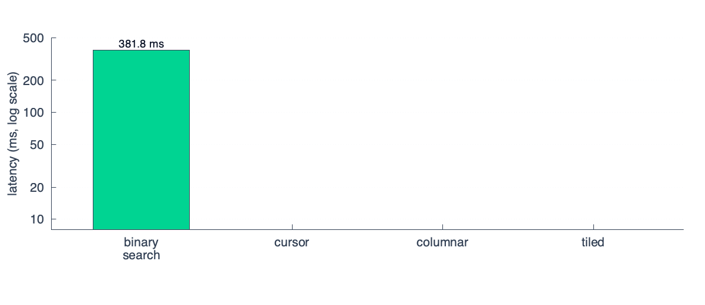
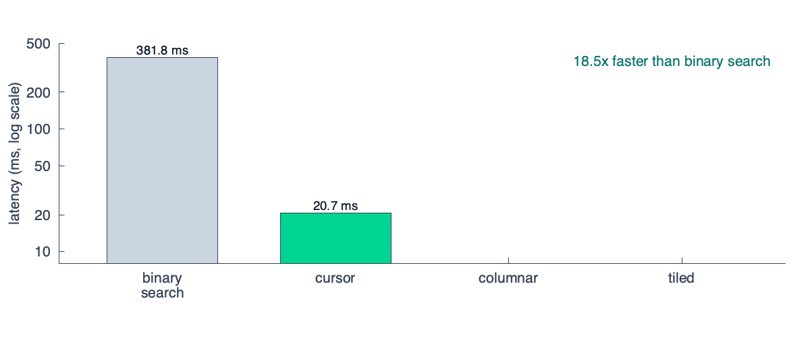
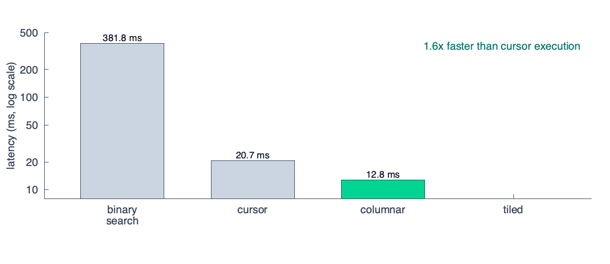
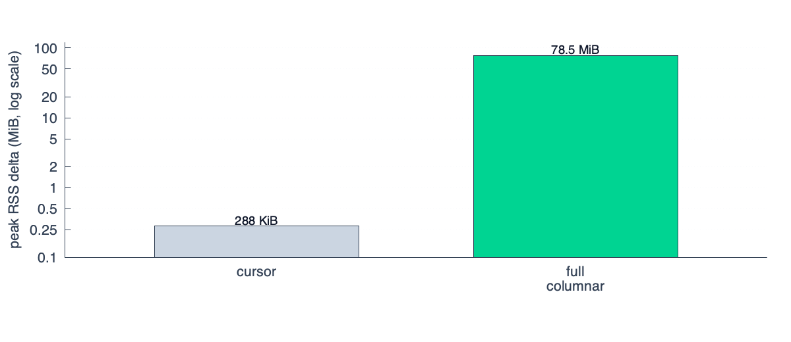
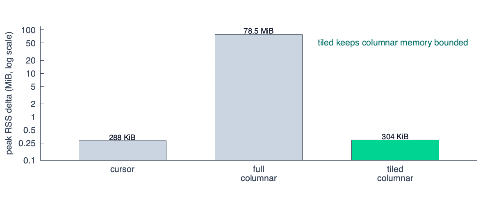
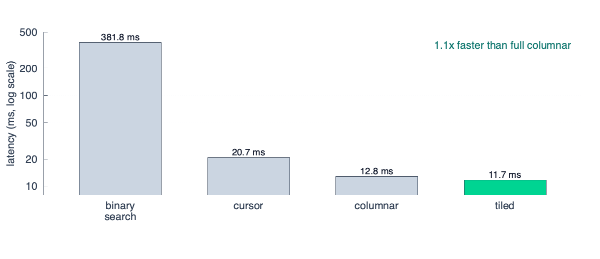

<Tldr>We reworked our query execution engine to 2x real world performance by using cache-friendly, tiled columnar execution.</Tldr>

Think about a timeseries query engine as processing a two-dimensional matrix of data: the vertical dimension is the series, the horizontal dimension is time, and the cells are the measurements at that time.

A query will filter on both dimensions (it selects the series that match your query *and* restricts it to the time range specified) before aggregating across the vertical dimension. In the diagram below the ✓ represent data that is included in the query and the highlighted slice is one "step" in the query.

```
                                                     ┌─bounds────────┐     
                                                     │start_ts: 12:00│     
                                                     │end_ts: 15:00  │     
                                                     │step: 1min     │     
                                                     │ ╭─╮  ╭─╮  ╭─╮ │     
                                               samples─┼─┼──┼─┼──┼─┼─┼───╮ 
 ┌─────────────────────────────────────────────┼─────┴─┼─┼──┼─┼──┼─┼─┴───┼┐
┌▶{instance='a2', path='/query', status='500'} │.......│✓│..│✓│..│✓│.....││
│└─────────────────────────────────────────────┼─────┬─┼─┼──┼─┼──┼─┼─┬───┼┘
│┌─────────────────────────────────────────────┼─────┴─┼─┼──┼─┼──┼─┼─┴───┼┐
├▶{instance='a2', path='/query', status='200'} │.......│✓│..│✓│..│✓│.....││
│└─────────────────────────────────────────────┼─────┬─┼─┼──┼─┼──┼─┼─┬───┼┘
│┌─ ─ ─ ─ ─ ─ ─ ─ ─ ─ ─ ─ ─ ─ ─ ─ ─ ─ ─ ─ ─ ─ ─│─ ─ ─│─│─│─ ┼ ┼ ─│─│─│─ ─│┐
││{instance='a1', path='/series', status='500'}│.......│.│..│.│..│.│.....││
│└─ ─ ─ ─ ─ ─ ─ ─ ─ ─ ─ ─ ─ ─ ─ ─ ─ ─ ─ ─ ─ ─ ─│─ ─ ─│─│─│─ ┼ ┼ ─│─│─│─ ─│┘
│┌─────────────────────────────────────────────┼─────┴─┼─┼──┼─┼──┼─┼─┴───┼┐
├▶{instance='a2', path='/series', status='500'}│.......│✓│..│✓│..│✓│.....││
│└─────────────────────────────────────────────┼─────┬─┼─┼──┼─┼──┼─┼─┬───┼┘
│                                              ╰─────┼─┼─┼──┼─┼──┼─┼─┼───╯ 
│                                                    └─┼─┼──┼─┼──┼─┼─┘     
│                                                      ╰▲╯  ╰▲╯  ╰▲╯       
│                                                       │    │    │        
│                                                       └────┼────┘        
│    ┌───────────────────────────────────────────────────────┼────────────┐
│    │ ┌────────────────────────────────────┐    ┌───────────┴──────────┐ │
└────┼─┤(http_requests_count{instance='a2'})│    │ sum by (path, status)│ │
     │ └────────────────────────────────────┘    └──────────────────────┘ │
     └─query──────────────────────────────────────────────────────────────┘
```

In this particular query, we attempt to plot a 3 hour interval starting at 12:00 that answers the question "how many requests were made to instance `a2` broken down by path and status code?".

This matrix is also approximately what's stored on disk: each series is keyed by an ID (as opposed to the full set of labels, as in the diagram) and the value is a compressed vector of samples using [Gorilla encoding](https://www.vldb.org/pvldb/vol8/p1816-teller.pdf).

Once you load up the relevant portion of this matrix into memory, you have a few options to compute the aggregation you want.

## Improving a naive algorithm

The most naive implementation evaluates the aggregation at each step.

```rust
// the final result of the aggregation, with one entry
// per group per step in the range
let result = Map<str, Map<i64, f64>>

for step in range:
    let samples = Map<str, [f64]>
    for series in matching_series:
      let group = series.labels[path] + series.labels[status]
      samples[group].append(series.find_sample(step))

    for (group, vals) in samples:
        result[group][step] = sum(vals)
```

To get a baseline performance, I setup a simple benchmark with a toy implementation of this query execution engine. I ran it with 5k series, 1024 samples/series and ran queries with 512 steps and 32 aggregation groups:



There are a few problems here, but many of them can be papered over by how trivially this query can be evaluated in parallel. The complexity is `O(T x S x log N)` (steps × series × samples per series), assuming each `find_sample` is a binary search over a series's samples.

A big improvement that turns this into `O(T x S)` is to make `find_sample` use stateful cursors that remember where they left off. In other words, you know that the steps are monotonically increasing (`val@01:00:00, val@01:00:30, …`) so you can linearly scan forward in one pass instead of binary searching each time.



This makes the parallelism more challenging to implement, but still possible if you split the range into chunks that you parallelize.

## Improving cache efficiency

A quick primer on how CPUs work: the data that you have in memory goes up through various levels of caches before they enter a CPU register, which allows the CPU to perform arithmetic on the bits. The higher level caches are extremely low latency (4-5 CPU cycles or ~1ns to load data from L1) while the lower levels of the cache are still fast, but slower (40-75 CPU cycles or ~15ns to load data from L3).

The problem is that these CPU caches are relatively small — ballpark numbers for L1/L2/L3 are 32KB/256KB/16MB respectively. This means the more data you need to shuffle between these caches the less efficient your queries are going to be.

The next improvement to our naive algorithm is to make it friendlier for these CPU caches. The initial implementation stored the raw sample data like this in memory (let's assume each series is exactly 32KB, enough to represent one thousand `(ts: i64, val: f64)` tuples in memory):

```
╔═════════════════════════════════════════════════════════════════════════════════════════════╗
║                                                                                             ║
║               current                    current                    current                 ║
║               step ptr                   step ptr                   step ptr                ║
║                  │                          │                          │                    ║
║      ┌─series1───┼──────────────┬─series2───┼──────────────┬─series3───┼──────────────┐     ║
║      │┌──────┬───▼──┐   ┌──────┐│┌──────┬───▼──┐   ┌──────┐│┌──────┬───▼──┐   ┌──────┐│     ║
║      ││ ts1  │ ts2  │   │ tsN  │││ ts1  │ ts2  │   │ tsN  │││ ts1  │ ts2  │   │ tsN  ││     ║
║      ││ val1 │ val2 │...│ valN │││ val1 │ val2 │...│ valN │││ val1 │ val2 │...│ valN ││     ║
║      │└──────┴──────┘   └──────┘│└──────┴──────┘   └──────┘│└──────┴──────┘   └──────┘│     ║
║      ├──────────────────────────┼──────────────────────────┼──────────────────────────┤     ║
║      │                          │                          │                          │     ║
║      └─ ─ ─ ─ ─ ─32KB ─ ─ ─ ─ ─ ┴─ ─ ─ ─ ─ ─32KB ─ ─ ─ ─ ─ ┴─ ─ ─ ─ ─ ─32KB ─ ─ ─ ─ ─ ┘     ║
║                                                                                             ║
╚═════════════════════════════════════════════════════════════════════════════════════════════╝
```

In our original algorithm, we have this line that we execute for every step for every series

```rust
samples[group].append(series.find_sample(step))
```

Even with the improvement to make `find_samples` leverage active cursors, we still quickly thrash our CPU caches.

To understand why we need to dig deeper into how CPUs work. When you read one pair of `(ts: i64, val: f64)` you theoretically only read 16 bytes, but physically you load 64 bytes that surround the data into cache as well. This is called a cache line, and it's the minimum amount of data you can move between caches. This means that when you load `(ts2, val2)` into your CPU, you'll get three other pairs hitching along for a free ride.

That means I can only ever hold 32KB / 64B = 500 series in my L1 cache at once. If my aggregation reads more than 500 series, I'll flush my entire cache before I go to process the next step and I'll need to read from L2 every time.

So how do we account for this in our algorithm? We modify it to be columnar:

```rust
for group in groups:
    matching_series = find_series(group)

    // Pass 1: transpose series-major to step-major representation
    let columnar_samples = [][]
    for idx, series in matching_series:
        for (ts, sample) in series:
          columnar_samples[ts][idx] = sample

    // Pass 2: aggregate
    for ts in steps:
      result[group][ts] = sum(columnar_samples[ts])
```

This transposes the array so that now your data looks like this:

```
╔═columnar transpose════════════════════════════════════════════════════════╗
║                                                                           ║
║                                                                           ║
║          ◀────────time─────────▶            ◀────────series───────▶       ║
║          ┌─────────────┬─┬─────┐            ┌─────────────────────┐       ║
║      ▲   │.............│✓│.....│            │.....................│ ▲     ║
║      │   │.............│✓│.....│            │.....................│ │     ║
║      │   │.............│✓│.....│            ├─────────────────────┤ │     ║
║   series │.............│✓│.....│─transpose─▶│✓✓✓✓✓✓✓✓✓✓✓✓✓✓✓✓✓✓✓✓✓│time   ║
║      │   │.............│✓│.....│            ├─────────────────────┤ │     ║
║      │   │.............│✓│.....│            │.....................│ │     ║
║      ▼   │.............│✓│.....│            │.....................│ ▼     ║
║          └─────────────┴─┴─────┘            └─────────────────────┘       ║
║                                                                           ║
╚═══════════════════════════════════════════════════════════════════════════╝
```

And if you zoom into one row using the same diagram style as before you can see that now when you aggregate the data for a given step, all the required samples are contiguous in memory (which prevents cache thrashing)

```
╔═════════════════════════════════════════════════════════════════════════════════════════════╗
║                                  current                                                    ║
║                                  step ptr                                                   ║
║                                     │                                                       ║
║                                     ▼                                                       ║
║      ┌─ts1──────────────────────┬─ts2──────────────────────┬─ts3──────────────────────┐     ║
║      │┌──────┬──────┐   ┌──────┐│┌──────┬──────┐   ┌──────┐│┌──────┬──────┐   ┌──────┐│     ║
║      ││  s1  │  s2  │   │  sN  │││  s1  │  s2  │   │  sN  │││  s1  │  s2  │   │  sN  ││     ║
║      ││ val1 │ val2 │...│ valN │││ val1 │ val2 │...│ valN │││ val1 │ val2 │...│ valN ││     ║
║      │└──────┴──────┘   └──────┘│└──────┴──────┘   └──────┘│└──────┴──────┘   └──────┘│     ║
║      ├──────────────────────────┼──────────────────────────┼──────────────────────────┤     ║
║      │                          │                          │                          │     ║
║      └─ ─ ─ ─ ─ ─32KB ─ ─ ─ ─ ─ ┴─ ─ ─ ─ ─ ─32KB ─ ─ ─ ─ ─ ┴─ ─ ─ ─ ─ ─32KB ─ ─ ─ ─ ─ ┘     ║
║                                                                                             ║
╚═════════════════════════════════════════════════════════════════════════════════════════════╝
```

After applying this change, we get another (relatively) large improvement, but much more modest than our original:



If you've been paying attention, you might wonder why this step doesn't negate the benefits:

```rust
columnar_samples[ts][idx] = sample
```

It does, after all, write randomly to different points in `columnar_samples` that aren't contiguous in memory.

The trick is that writes are more forgiving than reads. Modern CPUs have store buffers that queue writes and let them drain to cache asynchronously so the CPU doesn't stall waiting for the write to land. More importantly, each cell in `columnar_samples` is written exactly once and then read back later in a tight sequential loop. Even if our scattered writes evict cache lines, we never pay to re-read that evicted data during the transpose itself.

### Memory efficiency through tiling

At this point the columnar transpose is a single, all-at-once operation. We take the whole series-major matrix, flip it to step-major, and run the aggregation. This helped utilize L1 efficiently, but what happens to our memory utilization?

It turns out a typical dashboard query creates a transposed matrix that quickly blows past the L2 and even L3 cache sizes. A query touching 5K series across 500 steps (roughly what a single Grafana panel renders) is 20MB of `f64` values alone once deserialized into memory. If we naively materialize the full transpose, we just trade one cache thrashing into very poor memory utilization.



The fix is to tile the dataset, fetching and transposing rectangles of `K series × N steps` that we can comfortably store in L2:

```
╔═query grid══════════════════════════════════════════════════╗
║                                                             ║
║       ◄────────────── steps ──────────────►                 ║
║      ┌──────┬──────┬──────┬──────┬──────┐  ▲                ║
║      │ tile │ tile │ tile │ tile │ tile │  │                ║
║      ├──────┼──────┼──────┼──────┼──────┤  │                ║
║      │ tile │ tile │ tile │ tile │ tile │  │                ║
║      ├──────┼──────┼──────┼──────┼──────┤ series            ║
║      │ tile │ tile │ tile │ tile │ tile │  │                ║
║      ├──────┼──────┼──────┼──────┼──────┤  │                ║
║      │ tile │ tile │ tile │ tile │ tile │  ▼                ║
║      └──────┴──────┴──────┴──────┴──────┘                   ║
║                                                             ║
║      each tile = 512 series × 64 steps ≈ 256KB              ║
║      sized to fit in L2 with headroom                       ║
║                                                             ║
╚═════════════════════════════════════════════════════════════╝
```

The improvement in peak memory utilization is significant since we no longer transpose the entire matrix in memory at any given point in time:



While less efficient than the naive cursor approach (it does materialize a small step, after all) it has nearly the same memory utilization with significantly better performance.

There's the added benefit that each of these tiles can be configured to fit into L2 to not only save memory but also improve my cache efficiency and drive a minor performance win.

If my query is computing a `sum` I can load up all the values for a subset of the series for a subset of time and reduce it to a single `(ts, value)` pair per aggregation group before moving on to the next tile in the grid, allowing me to keep the important state cache-local.



And there you have it, a ~2x improvement by moving from a row-based pipeline to a columnar based pipeline (and a 32x improvement from the naive algorithm).

## Why storage isn't columnar in first place

We'll end on a design note that covers a question you may have had while reading this post. If the improvements that stem from columnar execution are so significant, why not store the data in a columnar fashion in first place?

The first thing to understand is what it means for data to be "columnar" in first place. If we want a columnar storage layout that mirrors our query layout, we need one column for each series. This is by no means feasible, since it requires tens of thousands of indexes, one for each column.

When a system like Victoria Metrics claims that its storage is "columnar", what it means is that timestamps and data points are stored separately instead of one column that contains an array of `(timestamp, value)` pairs:

```
┌─columnar─────────────────────────────────────────────────┐ 
│        ◀─────timestamps──────▶◀─────values──────────▶    │░
│        ┌─────────────┬─┬─────┐┌─────────────┬─┬─────┐    │░
│     ▲  │.............│✓│.....││.............│✓│.....│    │░
│     │  │.............│✓│.....││.............│✓│.....│    │░
│     │  │.............│✓│.....││.............│✓│.....│    │░
│ series │.............│✓│.....││.............│✓│.....│    │░
│     │  │.............│✓│.....││.............│✓│.....│    │░
│     │  │.............│✓│.....││.............│✓│.....│    │░
│     ▼  │.............│✓│.....││.............│✓│.....│    │░
│        └─────────────┴─┴─────┘└─────────────┴─┴─────┘    │░
└──────────────────────────────────────────────────────────┘░
 ░░░░░░░░░░░░░░░░░░░░░░░░░░░░░░░░░░░░░░░░░░░░░░░░░░░░░░░░░░░░
                                                             
                                                             
┌─row-based────────────────────────────────────────────────┐ 
│         ◀────────────(timestamp, value) pairs────────▶   │░
│         ┌─────────────┬──┬───────────────────────────┐   │░
│      ▲  │.............│✓✓│...........................│   │░
│      │  │.............│✓✓│...........................│   │░
│      │  │.............│✓✓│...........................│   │░
│  series │.............│✓✓│...........................│   │░
│      │  │.............│✓✓│...........................│   │░
│      │  │.............│✓✓│...........................│   │░
│      ▼  │.............│✓✓│...........................│   │░
│         └─────────────┴──┴───────────────────────────┘   │░
└──────────────────────────────────────────────────────────┘░
 ░░░░░░░░░░░░░░░░░░░░░░░░░░░░░░░░░░░░░░░░░░░░░░░░░░░░░░░░░░░░
```

But that is a different kind of columnar than the one we use during query execution. Splitting timestamps and values gives you two streams that can be compressed and decoded independently, which can be useful if a query only needs timestamps or only needs values.

We chose not to split them because most execution paths need both (handling lookback, computing rates / offsets, etc…), and this way we only need one index. With Gorilla-style encoding, the compression difference is usually small because both timestamps and values are already delta-encoded within the same series-local context.

The more important columnar layout is the temporary one we create during execution. While that layout is great for in-process aggregation it is awkward for storage.

## Further reading

A columnar execution engine that properly handles all types of aggregations and rollups is a beast to implement, but if you are curious you can review [the full design for the new engine](https://github.com/opendata-oss/opendata/blob/main/timeseries/rfcs/0007-promql-execution.md) on GitHub.

OpenData Timeseries is MIT-licensed and available today. If you have questions or feedback, drop into our [Discord](https://discord.gg/2Awkh6YVpP) and if you like what you see, consider starring us on [GitHub](https://github.com/opendata-oss/opendata/).
