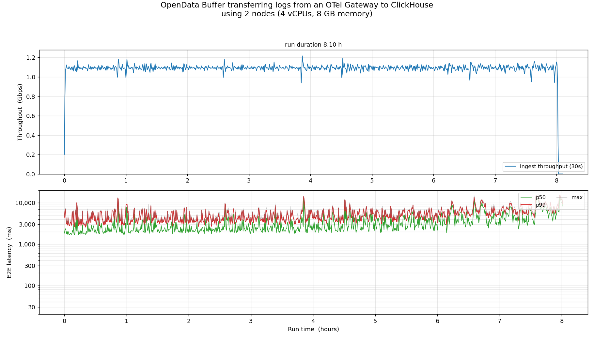

When we [announced OpenData Buffer](https://www.opendata.dev/blog/buffer-ha-pipelines-without-kafka) last month people asked about writing to systems like ClickHouse, which is one of the most popular destinations for high volume event data like metrics and logs.

Today, we're announcing a few extensions for *Buffer*:

1. a pipelined producer client with native OTel exporter integration
2. a pipelined consumer runtime
3. a ClickHouse integration with aligned batch deduplication

These changes taken together allowed us to transfer 1.1 Gbps of log data from an OTel Gateway to ClickHouse via S3:

<table style="width:auto">
  <tbody>
    <tr>
      <th scope="row" style="border-bottom:1px solid #f1f5f9;padding-right:3rem">Throughput</th>
      <td>1.1 Gbps</td>
    </tr>
    <tr>
      <th scope="row" style="border-bottom:1px solid #f1f5f9;padding-right:3rem">p50 E2E Latency</th>
      <td>~2.8s</td>
    </tr>
    <tr>
      <th scope="row" style="border-bottom:1px solid #f1f5f9;padding-right:3rem">p99 E2E Latency</th>
      <td>~10s</td>
    </tr>
    <tr>
      <th scope="row" style="border-bottom:1px solid #f1f5f9;padding-right:3rem">Monthly Cost (S3)</th>
      <td>$180</td>
    </tr>
    <tr>
      <th scope="row" style="border-bottom:1px solid #f1f5f9;padding-right:3rem">Producer/Consumer Nodes</th>
      <td>2x (4vCPU + 8GB RAM)</td>
    </tr>
  </tbody>
</table>

The new Buffer clients also have at-least-once delivery semantics with sink-side deduplication: every data batch has a unique identifier which is stable across retries. This provides the basic mechanism for sinks to deduplicate retried data, which is something the ClickHouse sink leverages.

## The Benchmark

A single loadgen program drove 175,000 log records/sec into one OTel gateway pod over OTLP/gRPC. The OTel gateway ran the [OpenData producer](https://github.com/opendata-oss/opendata-go#producer-architecture) which batched, encoded, and appended OTel payloads to OpenData Buffer on S3. A separate node running the [ClickHouse-ingestor](https://github.com/opendata-oss/opendata-contrib/tree/main/connectors/clickhouse-ingestor) consumed the *Buffer* payloads and inserted them into ClickHouse.

We measured end-to-end latency from two timestamps added to each record as it traversed the pipeline:

- `_odb_gateway_received_at`: stamped by the OTel exporter the moment the gateway received the record.
- `_odb_clickhouse_inserted_at`: stamped at INSERT time when the ClickHouse sink wrote the row.

Throughput and latency held stable, with the system transferring 1.1 Gbps of compressed data throughout.

The S3 costs for this run break down as follows:

| S3 cost component | Measured rate | List price (us-east-1) | Monthly |
| --- | --- | --- | --- |
| **PUTs** — batch uploads (7.1/s) + manifest CAS commits (5.3/s) | ~12.5 /s | $0.005 / 1k | ~$162 |
| **GETs** — consumer fetches + producer pre-CAS reads + polls | ~16 /s | $0.0004 / 1k | ~$17 |
| **Storage** — batches GC'd promptly after ack | tens of GB | $0.023 / GB-mo | < $5 |
| **Network** — in-region via S3 Gateway endpoint | — | $0 | $0 |
| **Total** | | | **~$180** |

Since S3 completely replaces a system like Kafka, it's meaningful to compare those $180/mo S3 costs with Kafka. Using the popular [AKalculator](https://2minutestreaming.com/tools/apache-kafka-calculator/), this workload would cost $24,667/mo on Apache Kafka. WarpStream would cost $3,096/mo at the Fundamentals Tier.

### Batching, Pipelining, and Parallelizing IO

S3 has high per-request latency (tens to hundreds of milliseconds) but enormous aggregate bandwidth. A single-threaded producer doing `put → wait → put → wait` leaves most of that bandwidth on the floor. To really push the throughput limits of object storage, you need as many overlapping requests in flight as possible on both sides of the queue.

That's why the producer and consumer runtimes both run as pipelined workloads against object storage:

On the producer side, requests are batched by an accumulator, and then two threadpools work to encode/compress batches and upload them in parallel. Once batches are uploaded, a single thread commits them to the Buffer manifest on object storage using a compare-and-set (CAS) operation. This CAS operation is the main point of contention, and amortizing its cost against multiple large data batches is what unlocks the throughput. In our setup, on average 1.3 16MB batches were committed with one CAS.

On the consumer side, Buffer's read-ahead API hands the runtime multiple batch descriptors per manifest GET. The fetch pool grabs objects in parallel, the decode pool runs in parallel, and the sink writer parallelizes writes to ClickHouse. An ack coordinator advances the Buffer offset only after the sink has durably committed a continuous range of offsets and never advances over a hole. Similar to the producer, the ack coordinator can dequeue multiple batches in one CAS.

## Deduplication via stable batch identities

Buffer's new pipelined consumer is designed to ensure that every batch passed to a sink writer has a unique identity which is stable across restarts. In particular, every source range carries a deterministic identity, `(source, sink, low_sequence, high_sequence, schema_version)`, that is byte-identical across replay.

The sink derives its deduplication token from that identity plus its own config. For instance, the ClickHouse sink generates a deduplication token based on the batch ID passed on by the runtime plus its chunking config. A stable chunking config means that every retry will result in identical deduplication tokens for retried chunks, which enables ClickHouse to deduplicate inserts within a given retry window.

## What's next

The ClickHouse sink is the first integration we've built on our pipelined clients. The consumer runtime is designed to support a wide variety of target systems, which can all share its pipelining and batching architecture. We plan to add an Iceberg sink in the near future.

With a native OTel exporter integration, and with ClickHouse and Iceberg sinks, we believe a vast majority of high volume pipelines could use Buffer productively.

All of Buffer's components are MIT licensed. If you want to explore the system, the best place to start is our [tutorial](https://github.com/opendata-oss/opendata-contrib/tree/main/tutorial) which will get a local deployment of our OTel to ClickHouse pipeline working in 5 minutes. If you're curious about the design, check out the design doc for the [pipelined consumer](https://github.com/opendata-oss/opendata-contrib/blob/main/rfcs/0002-generic-ingest-runtime.md).

If you're building a system that can integrate or have other questions, join our [Discord](https://discord.gg/2Awkh6YVpP) and chat with us. We'd love to onboard your use case onto our ecosystem.
