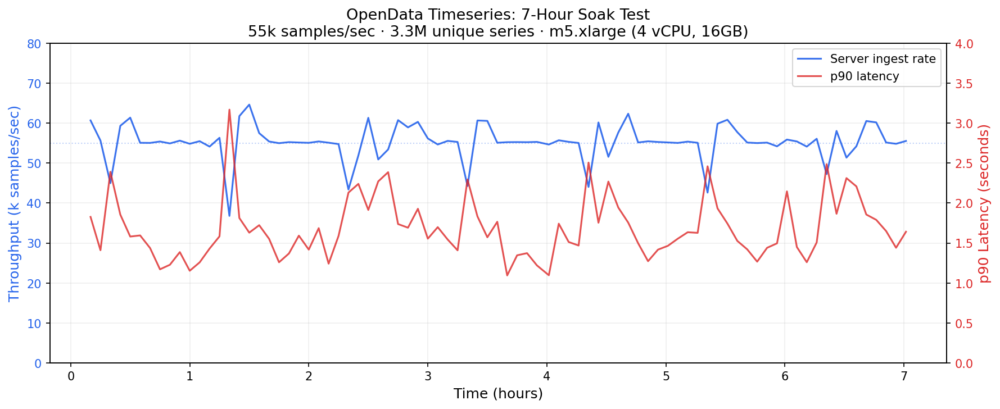
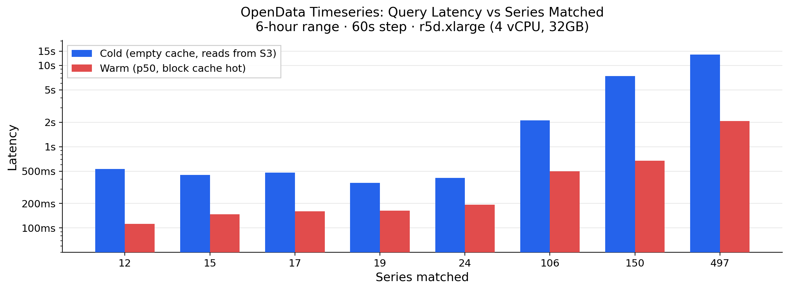

Over the last few years, one of the big developments in the database world has been the emergence of object-store-native databases. If object storage is the only persistence layer, compute can be effectively stateless, which makes these systems much simpler to operate. They are also much cheaper, because they don't pay inter-az networking costs to replicate data, and because storing cold data on object storage is 80-90% cheaper than storing it on disks.

The most compelling validations of this approach are [WarpStream](https://www.warpstream.com/blog/kafka-is-dead-long-live-kafka) and [turbopuffer](https://turbopuffer.com/blog/turbopuffer). They applied object-store-native designs to streaming and vector databases and showed that these designs deliver a winning performance and cost combination.

Surprisingly, the Prometheus-compatible TSDBs that power modern observability stacks have not made this transition yet. As a result, self-hosting Prometheus-compatible systems at scale means operating another unforgiving distributed storage system, which justifies paying the brutally expensive hosted observability providers.

[OpenData Timeseries](https://www.opendata.dev/docs/timeseries) fills that gap. It is an MIT-licensed, Prometheus-compatible timeseries database built on [SlateDB](https://www.slatedb.io/), an object-store-native LSM tree. It supports PromQL, Prometheus scraping, Prometheus remote write, and OTLP metrics ingest. OpenData Timeseries can power your Grafana dashboards and alerts for a fraction of the price of managed offerings: our internal benchmarks show that you can serve 4.7B samples/day over 3.3M active series for $500/month of compute costs.

## A simpler storage model for timeseries

To see what object-store-native architectures simplify, look at what a production [Cortex](https://cortexmetrics.io/) deployment requires.

The [Cortex architecture](https://cortexmetrics.io/docs/architecture/) specs out a half dozen required services just to get writes durable, queries served, and blocks compacted. Queries have to stitch together recent ingester state with historical object-store state through store-gateways.

Here is the minimal architecture of Cortex:

```
                                                                                     ┌─ ─ ─ ─ ─ ─┐
                                                                                     │ Compactor │
                        ╔═Write Path═══════════════════════════════════╗             └─ ─ ─ ─ ─ ─┘
                        ║                                              ║                   │
                        ║                               ┏━━━━━━━━━━━━┓ ║                compact
╭────────────╮          ║         ┌─ ─ ─ ─ ─ ─ ─┐   ┌───▶ Ingester 1 ┃ ║                   │
│ Prometheus ├───remote write─────▶ Distributor ├───┤   ┗━━━━━━━━━━━━┛ ║          ╔════════▼═══════╗
╰────────────╯          ║         └─ ─ ─ ┬ ─ ─ ─┘   │   ┏━━━━━━━━━━━━┓ ║          ║ Object Storage ║
                        ║                │          ├───▶ Ingester 2 ├─╫─flush────▶ (S3/GCS/Azure) ║
                        ║              hash         │   ┗━━━━━━━━━━━━┛ ║          ╚════════▲═══════╝
                        ║                │          │   ┏━━━━━━━━━━━━┓ ║                   │
                        ║                │          └───▶ Ingester 3 ┃ ║                   │
                        ║        ┌───────▼───────┐      ┗━━━━━━▲━━━━━┛ ║                   │
                        ╚════════╡   Hash Ring   ╞═════════════╪═══════╝                   │
                                 │ (Consul/etcd) │             │                           │
                                 └───────────────┘             │             ┌read blocks──┘
                                                               │             │
                                                      ┌recent──┘             │
                                                      │                      │
                                                      │                      │
                                                      │                      │
                        ╔═Read Path═══════════════════╪══════════════════════╪═══════╗
                        ║      ┌─ ─ ─ ─ ─ ┐           │                 ┏━━━━┴━━━━┓  ║
   ╭─────────╮          ║      │  Query   │      ┌─ ─ ┴ ─ ─┐            ┃  Store  ┃  ║
   │ Grafana ├─────PromQL──────▶ Frontend ───────▶ Querier ├────────────▶ Gateway ┃  ║
   ╰─────────╯          ║      └─ ─ ─ ─ ─ ┘      └─ ─ ─ ─ ─┘            ┗━━━━━━━━━┛  ║
                        ╚════════════════════════════════════════════════════════════╝


                                     ┌Legend──────────────────────┐
                                     │  ━━━  stateful             │▓
                                     │  ─ ─  stateless            │▓
                                     │  ═══  region / data store  │▓
                                     └────────────────────────────┘▓
                                      ▓▓▓▓▓▓▓▓▓▓▓▓▓▓▓▓▓▓▓▓▓▓▓▓▓▓▓▓▓▓
```

The complexity stems from having to directly manage sharding and replication in order to satisfy durability and scaling requirements. Newer Prometheus-compatible TSDBs like VictoriaMetrics have simpler architectures, but they still have stateful storage servers, and thus retain the same operational challenges of re-replication and rebalancing when they fail or need to be scaled out.

By contrast, once object storage is the only durable layer and disks are demoted to caches, most of the machinery these systems need for durability disappears. You no longer need quorum replication across stateful nodes just to make writes safe, and you can add or remove nodes without shuffling state around.

OpenData Timeseries takes advantage of exactly that. Although you can run OpenData Timeseries in a single server, we recommend separating the writer (indexer) from the reader (query server). The writer ingests metrics (via Prometheus Remote writes, OTLP writes, etc) and creates index structures on object storage. The reader serves queries by loading and caching indexed data from object storage.

```
                   ╔═opendata timeseries═══════════════════════════════╗
                   ║                                                   ║
                   ║       ┌─ ─ ─ ─ ─ ─ ─┐       ┏━━━━━━━━━━━━━┓       ║
                   ║       │             │       ┃             ┃       ║
        ┌────remote ───────▶   writer            ┃   reader    ┃       ║
        │    write ║       │             │       ┃             ┃       ║
        │          ║       └─ ─ ─ ▲ ─ ─ ─┘       ┗━━━━━━▲━━━━━━┛       ║
┌───────┴──────┐   ║              │                     │              ║
│otel collector│   ║              │                     │              ║
└───────┬──────┘   ║       ╔══════▼═════════════════════╧══════╗       ║
        │          ║       ║          object storage           ║       ║
        └───stateless──────▶           (S3/GC/Azure)           ║       ║
            ingest ║       ╚═══════════════════════════════════╝       ║
                   ║                                                   ║
                   ╚═══════════════════════════════════════════════════╝
```

For most workloads, durable metrics storage is thus a pair of servers and an object store bucket with no direct network communication between them. This has several operational advantages:

- If a node restarts, the system just keeps going once it's back since all the state any node needs is on object storage.
- Ingestion throughput can be scaled by scaling up a writer. This is trivial since the writer is completely stateless.
- Query throughput can be scaled by scaling up readers or by adding reader replicas. No additional orchestration is required since readers hydrate their caches straight from object storage while serving queries.

Additionally, the optional [stateless ingestor](https://github.com/opendata-oss/opendata/blob/main/ingest/rfcs/0001-stateless-ingest.md) plugs in as an OTel exporter and writes metric batches directly to object storage, with the Timeseries writer consuming the batches asynchronously and then writing indexed data back to object storage. So you get the write availability of object storage itself and you don't incur cross-az transfer fees to write your metrics.

## Why SlateDB is a big unlock

LSM trees have emerged as the de facto standard for performant object-store-native systems, evidenced by [WarpStream](https://www.warpstream.com/blog/the-road-to-100pibs-and-hundreds-of-thousands-of-partitions-goldsky-case-study#warpstream-storage-v2-aka-big-clusters), [QuickWit](https://quickwit.io/docs/overview/architecture), and [turbopuffer](https://turbopuffer.com/docs/concepts#log-structured-merge-lsm-tree)'s custom LSM tree implementations. Object storage works best when writes are batched into large immutable files rather than applied as fine-grained mutations. LSM trees are built around exactly that pattern: they absorb small writes in memory, flush them as immutable SSTs, compact them in the background, and keep hot blocks cached locally.

The problem is that existing LSM implementations are deeply coupled with local filesystems, which is why every object-store-native database implements it anew. We've tackled this problem head on and spent the last two years building [SlateDB](https://www.slatedb.io/), the first open source project implementing an LSM tree natively on object storage. This battle hardened foundation has accelerated the development of new object-store-native data systems, with a budding community of open source systems like S2, ZeroFS and our OpenData project.

LSM trees are also a perfect fit for timeseries databases. The two main operations, indexing series and loading samples, map naturally to an LSM tree's put/get/scan operations. Additionally, LSM trees are excellent at high volume ingestion, which is also one of the main requirements of an observability workload. You can learn more about the exact data structures and how we mapped timeseries indexes into a key-value model in this [design note](https://github.com/opendata-oss/opendata/blob/main/timeseries/rfcs/0001-tsdb-storage.md).

## Tradeoffs

Object storage adds end-to-end latency and makes cold reads slower, but those tradeoffs are surprisingly acceptable for observability workloads.

### Cold reads

Cold reads pay object-store round-trip latency (10-100ms). There is no way around that. So if your query needs data that's not cached locally, the query will be slower than the same query against a disk-resident system.

SlateDB's block cache is what makes this workable in practice. SlateDB divides data into 4KB blocks and uses [Foyer](https://github.com/foyer-rs/foyer) to keep those blocks in memory or on disk based on read activity. Local NVMe disks can be used to keep weeks of data warm extremely cost-effectively, which will satisfy a majority of alerting and dashboarding queries.

There is a second lever for older data. Wide historical queries need not keep loading the same raw bucket layout forever. As data ages, compaction can fold buckets together and merge samples at compaction time so historical scans touch less data. That work is still early in OpenData Timeseries, but it fits within the SlateDB compaction framework.

### End-to-end write latency

Object storage pushes you toward batching writes and flushing immutable objects. Fresh data therefore takes longer to become queryable than it would in a local-disk system that commits to a WAL and serves directly from local state.

For observability, that tradeoff is often acceptable. Dashboards are already delayed by scrape intervals (the Prometheus default is a 1 minute scrape interval). So teams are not making millisecond-by-millisecond decisions from Prometheus graphs. In that context, 1-5 additional seconds of end-to-end latency is barely noticeable.

## What one OpenData Timeseries node can do today

Here is what a single node delivers today on real benchmarks. The system is early and there is plenty of room to optimize further, but we are already capable of handling meaningful volumes today.

### Ingestion

To measure ingestion, we ran [p8s-bench](https://github.com/responsivedev/p8s-bench) (a harness around VictoriaMetrics' [prometheus-benchmark](https://github.com/VictoriaMetrics/prometheus-benchmark) tool) to measure the ingestion capacity of a single `m5.xlarge` node with 4 vCPUs and 16GB of RAM, backed by SlateDB on S3. The load generator was configured to generate samples for 5100 targets every 60 seconds, for a total of ~3.3M unique series.

For this workload, OpenData Timeseries sustained the ingestion of about **55k samples/sec, or 4.7B samples/day** on the single `m5.xlarge` node while flushing data durably to S3:



An m5.xlarge costs about $140/month of compute before storage and request charges. Assuming 2 `r5d.xlarge` reader nodes with a 140GB local NVMe at about $210/mo, **the total compute cost of an OpenData Timeseries cluster ingesting 3.3M unique series and 4.7B samples/day is $560**.

This number answers a very practical question: what does one box buy me? Our benchmarks show that, even today, OpenData Timeseries can handle meaningful data volumes efficiently.

It also gives a useful cost anchor against managed alternatives. Here is what the same workload would cost on popular managed Prometheus-compatible platforms, at published rates:

| Provider | Pricing model | Est. monthly cost |
| --- | --- | --- |
| [Amazon Managed Prometheus](https://aws.amazon.com/prometheus/pricing/) | $0.90 per 10M samples ingested | ~$12,830 |
| [Grafana Cloud](https://grafana.com/pricing/) Pro | $6.50 per 1,000 active series | ~$21,443 |
| [Grafana Cloud](https://grafana.com/pricing/) Enterprise (min $2000/mo commit) | ~$3.00 per 1,000 active series | ~$9,897 |
| Self hosted OpenData Timeseries | reader and writer node costs, plus S3 costs | ~$560 + S3 costs |

Datadog is harder to compare directly: its [public pricing](https://www.datadoghq.com/pricing/) lists custom metrics at $1 per 100 per month, but metrics from supported integrations are included in per-host fees. Still, at any significant volume of custom metrics the cost gap with self-hosted infrastructure is large.

None of these numbers are exact, but the structural gap is clear: a handful of nodes costing roughly $560/month versus $10,000-20,000/month for a managed service at the same scale. As we explained earlier, it's practical to operate OpenData Timeseries yourself and fully realize these massive cost savings since it isn't a traditional distributed database that manages partitioned and replicated state.

### Query latency

Query latency depends mostly on how much data the query has to touch, and whether that data is already in the SlateDB block cache. Here is a chart of cold and warm query latency as a function of the number of series that are matched and scanned over a 6 hour time range:



The warm numbers are the ones that matter for day-to-day use, since alerts and active dashboards will naturally keep their data warm. Once recent data is in the block cache, queries stop paying object-store round trips. On the benchmark `r5d.xlarge` node, roughly 8 GB of RAM plus about 140 GB of NVMe-backed disk cache are enough to keep several weeks of data locally warm, assuming 1-2 bytes per sample for Gorilla-compressed blocks.

Reducing query latency is the biggest area of improvement for OpenData Timeseries today, and one we are actively focused on.

For warm queries, there is room to tune the SlateDB block cache for greater efficiency as well as cache more of the heavily used structures within a single query eval loop, which we expect will drop warm latencies by over 50% based on our existing benchmarks.

For cold queries, [proactive metadata warming](https://github.com/opendata-oss/opendata/pull/412), fine tuned parallelism, and more request batching are the optimizations we have in the pipe which we expect will drop cold latencies by 25-30%.

## What's next

OpenData Timeseries replaces the half-dozen services, quorum replication, and shard management of a traditional timeseries database stack with one write server, zero or more read replicas and an object store bucket. That is a meaningful reduction in operational complexity, and it comes with attractive economics: you can monitor 3.3 million active series for about $500/month of compute.

OpenData Timeseries is also one proof point for a bigger idea. If object storage and SlateDB can remove this much complexity from a timeseries database, then the same foundation should apply to other databases too. Growing application stacks rarely run just one database. The OpenData project's goal is to bring the same simplified operating model and cost benefits to the other database categories modern applications depend on, and meaningfully reduce the cost and complexity of the typical application stack.

OpenData Timeseries is MIT-licensed and available today. If you want to try it, start with the [quickstart](https://www.opendata.dev/docs/timeseries/quickstart). If you have questions or feedback, drop into our [Discord](https://discord.gg/2Awkh6YVpP). And if you like what you see, consider giving us a star on [GitHub](https://github.com/opendata-oss/opendata/).
