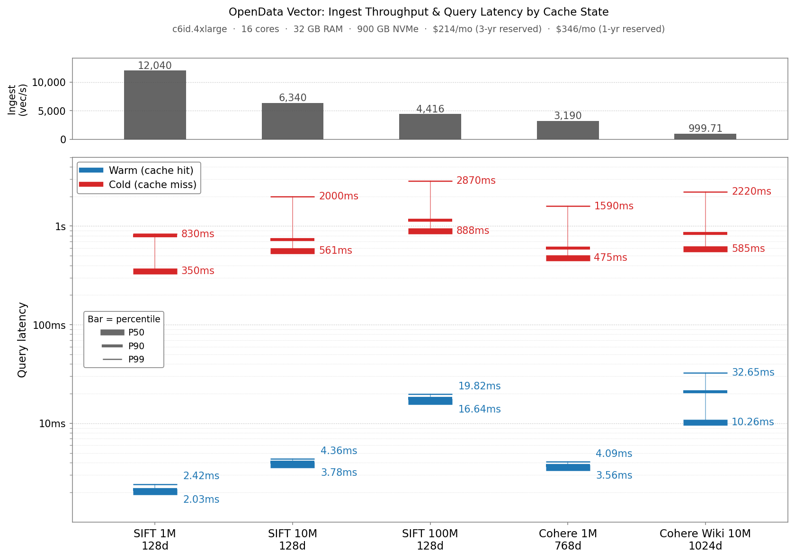
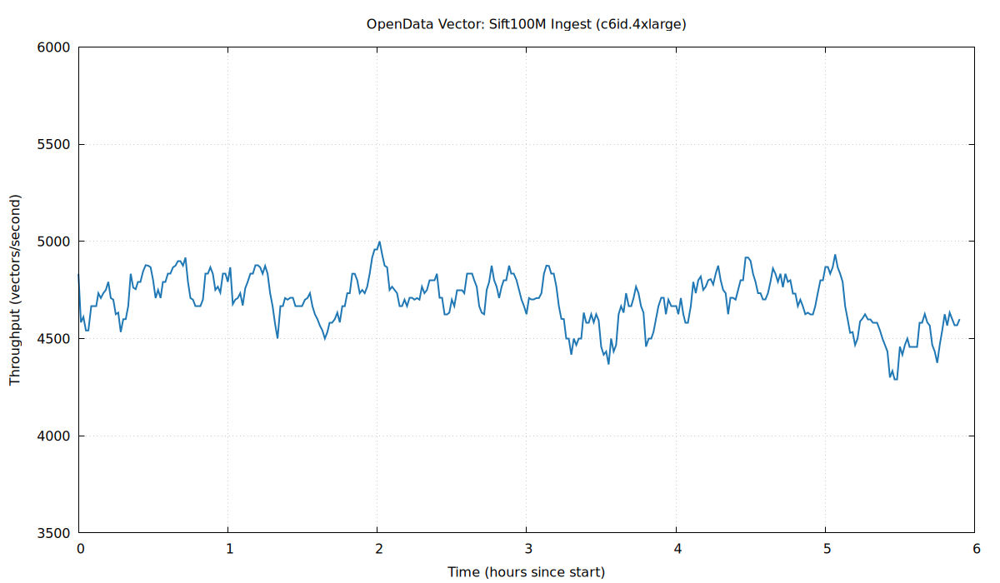

OpenData *Vector* fills the gap between running `pgvector` and paying a vendor many multiples of hardware costs to operate a search database for you.

MIT-licensed and built on [SlateDB](https://github.com/slatedb/slatedb), OpenData *Vector* is a stateless, durable, and highly-available search engine that runs anywhere with access to Object Storage. It is designed to be simple enough to operate yourself, and efficient enough to serve 100M 128-dimensional vectors for roughly $350/mo.

## Stateless vector search

There's growing consensus in the database community that object storage is a "good thing". The 99.999999999% durability SLAs, the cost efficiency (1/4 storage cost, $0 cross-AZ networking), and the strong consistency are all distributed system nightmares that are solved by object storage.

Because of this, over the last decade online systems have steadily increased their dependency on object storage. The first generation systems were *tiered*, the second were fully *disaggregated* and the third (and current) generation are *stateless*.

```
┏━Gen 1: Tiered Storage━━━━━━━━━━┓    ┏━Gen 2: Disaggregated━━━━━━━━━━━┓ 
┃                                ┃█   ┃                                ┃█
┃    ╭──────────────────────╮    ┃█   ┃    ╭──────────────────────╮    ┃█
┃    │        Query         │    ┃█   ┃    │        Query         │    ┃█
┃    ╰───────────┬──────────╯    ┃█   ┃    ╰───────────┬──────────╯    ┃█
┃                │               ┃█   ┃                │               ┃█
┃      ┌─────────┘               ┃█   ┃     ┌──────────┘               ┃█
┃      │                         ┃█   ┃     │     ╭─────────╮          ┃█
┃   ╔══▼═╗    ╔════╗    ╔════╗   ┃█   ┃  ┌──▼─┐   │ Cluster │    ┌────┐┃█
┃   ║ A  ├────▶ B  ├────▶ C  ║   ┃█   ┃  │ A  ├───▶ Manager ◀────┤ B  │┃█
┃   ╚══┬═╝    ╚══┬═╝    ╚══┬═╝   ┃█   ┃  └──┬─┘   ╰─────────╯    └──┬─┘┃█
┃      └─────────┼─────────┘     ┃█   ┃     └──────────┬────────────┘  ┃█
┃                │               ┃█   ┃                │               ┃█
┃    ┌───────────▼──────────┐    ┃█   ┃    ╔═══════════▼══════════╗    ┃█
┃    │     S3 (cold)        │    ┃█   ┃    ║  S3 (durable state)  ║    ┃█
┃    └──────────────────────┘    ┃█   ┃    ╚══════════════════════╝    ┃█
┃                                ┃█   ┃                                ┃█
┗━━━━━━━━━━━━━━━━━━━━━━━━━━━━━━━━┛█   ┗━━━━━━━━━━━━━━━━━━━━━━━━━━━━━━━━┛█
 ██████████████████████████████████    ██████████████████████████████████
                                                                         
                                                                         
                  ┏━Gen 3: Stateless━━━━━━━━━━━━━━━┓                     
                  ┃                                ┃█                    
                  ┃    ╭──────────────────────╮    ┃█                    
                  ┃    │        Query         │    ┃█                    
                  ┃    ╰───────────┬──────────╯    ┃█                    
                  ┃                │               ┃█                    
                  ┃      ┌─────────┼─────────┐     ┃█                    
                  ┃      │         │         │     ┃█                    
                  ┃   ┌──▼─┐    ┌──▼─┐    ┌──▼─┐   ┃█                    
                  ┃   │ A  │    │ B  │    │ C  │   ┃█                    
                  ┃   └──┬─┘    └──┬─┘    └──┬─┘   ┃█                    
                  ┃      └─────────┼─────────┘     ┃█                    
                  ┃                │               ┃█                    
                  ┃    ╔═══════════▼══════════╗    ┃█                    
                  ┃    ║   S3 (only truth)    ║    ┃█                    
                  ┃    ╚══════════════════════╝    ┃█                    
                  ┃                                ┃█                    
                  ┗━━━━━━━━━━━━━━━━━━━━━━━━━━━━━━━━┛█                    
                   ██████████████████████████████████                    
```

The second generation systems (such as Chroma & Milvus) improved on the first in that durability and replication were delegated to object storage, but nodes are still statefully assigned shards to serve from local data and require coordination between them to rebalance work. The third generation improves on the second by delegating metadata management to object storage as well, enabling any node to serve any data.

These *stateless* systems are significantly simpler, and therefore cheaper, more reliable, and easier to operate than their predecessors.

It is challenging to adapt a second generation system to be truly *stateless*, instead systems must be designed from the ground up (leader election, caching, compute allocation, etc…) to natively support object storage. As far as we are aware, OpenData *Vector* is the only OSS third generation, online vector database that is generally available (though Turbopuffer is a proprietary system that shares a similar architecture).

## Vector's stateless architecture

*Vector* makes a stateless vector search engine possible by making three key architectural decisions: IVF indexing, LIRE compaction on an LSM tree, and share-everything state. We detail these decisions on our [public RFC on GitHub](https://github.com/opendata-oss/opendata/blob/main/vector/rfcs/0001-storage.md).

**IVF/SPANN Indexing**

To be competitive on performance and cost with a stateless architecture, Vector's index needs to be optimized for object storage's high latency and expensive GET requests. This means fetching index data in batches.

Vector does this by maintaining an inverted-file index (IVF) based on [SPFresh](https://arxiv.org/pdf/2410.14452v1). The index groups vectors into clusters using k-means. Each cluster is represented by a "central" vector called a centroid, which holds references to vectors in its cluster via a "posting list" in SlateDB. Search proceeds by finding the nearest centroids to the query, and then exhaustively scoring the vectors from their posting lists.

The main alternative to IVF-style indexes are graph-based indexes like HNSW or Vamana. We chose an inverted index for 2 main reasons. First, graph indexes require a traversal that hops node-by-node across the index, requiring sequential GET requests to object storage (where first-byte latency can be up to 100ms). IVF, despite its relatively imprecise retrieval algorithm, can batch load data per round trip. This more than makes up for the increased compute needs on cache misses, which must make their way to object storage. Second, graph-based indexes are very expensive to maintain incrementally as new writes arrive.

**LSM-based LIRE Compaction**

Since object storage doesn't tolerate read-modify-write loops, data ingestion and index maintenance must use an append-only model with reconciliation happening during compaction.

To support append-only incremental updates to the index, Vector adapts the LIRE protocol from SPFresh. For each batch of writes, the writer adds the new vectors to the closest centroids' postings. When postings grow too large, the writer splits the posting by re-running k-means and computing new centroids.

LIRE requires lots of incremental updates to add vectors to and move them between posting lists. Vector applies a novel, lazy adaptation of LIRE's incremental updates using [SlateDB merges](https://slatedb.io/rfcs/0006-merge-operator/) to minimize write amplification and maintain high ingest throughput.

**Share Everything**

Vector stores *all* of its state in SlateDB, which means that any deployed node has full access to both metadata and data on object storage. Nodes never communicate with each other directly. Readers always operate against a SlateDB snapshot, ensuring they see a consistent view of state without relying on an external consistent database.

## Simple enough to DIY deploy

As with all OpenData systems, the stateless architecture of *Vector* makes it feasible to run a production system on a single Kubernetes pod.

In order to handle a variety of different requirements, however, *Vector* can run with various configurations and provide higher levels of availability without sacrificing the simplicity of the deployment:

```
┏━Topology 1: Embedded━━━━━━━━━━━━━┓    ┏━Topology 2: Single-Node━━━━━━━━━━┓ 
┃                                  ┃█   ┃                                  ┃█
┃ ╭───────Your Application───────╮ ┃█   ┃ ╭────────Vector Process────────╮ ┃█
┃ │ ╭──────╮ ╭──────╮ ╭────────╮ │ ┃█   ┃ │     ╭──────╮    ╭──────╮     │ ┃█
┃ │ │Writer│ │Reader│ │App Code│ │ ┃█   ┃ │     │Writer│    │Reader│     │ ┃█
┃ │ ╰──────╯ ╰──────╯ ╰────────╯ │ ┃█   ┃ │     ╰──────╯    ╰──────╯     │ ┃█
┃ ╰───────────────┬──────────────╯ ┃█   ┃ ╰───────────────┬──────────────╯ ┃█
┃                 │                ┃█   ┃                 │                ┃█
┃                 │                ┃█   ┃                 │                ┃█
┃       ╔═════════▼════════╗       ┃█   ┃       ╔═════════▼════════╗       ┃█
┃       ║        S3        ║       ┃█   ┃       ║        S3        ║       ┃█
┃       ╚══════════════════╝       ┃█   ┃       ╚══════════════════╝       ┃█
┃                                  ┃█   ┃                                  ┃█
┃                                  ┃█   ┃                                  ┃█
┗━━━━━━━━━━━━━━━━━━━━━━━━━━━━━━━━━━┛█   ┗━━━━━━━━━━━━━━━━━━━━━━━━━━━━━━━━━━┛█
 ████████████████████████████████████    ████████████████████████████████████
                                                                             
┏━Topology 3: Writer + Readers━━━━━┓    ┏━Topology 4: Buffered Ingest━━━━━━┓ 
┃                                  ┃█   ┃                                  ┃█
┃             ╭──────╮             ┃█   ┃       ╭──────────────────╮       ┃█
┃             │Writer│             ┃█   ┃       │ Buffer Producer  │       ┃█
┃             ╰───┬──╯             ┃█   ┃       ╰─────────┬────────╯       ┃█
┃                 │                ┃█   ┃                 │                ┃█
┃ ╔═══════════════▼══════════════╗ ┃█   ┃ ╔═══════════════▼══════════════╗ ┃█
┃ ║              S3              ║ ┃█   ┃ ║              S3              ║ ┃█
┃ ╚═══════════════┬══════════════╝ ┃█   ┃ ╚═══════════════▲══════════════╝ ┃█
┃                 │                ┃█   ┃          ┌──────┴──────┐         ┃█
┃             ╭───▼──╮             ┃█   ┃     ╭────▼───╮    ╭────▼───╮     ┃█
┃             │Reader│             ┃█   ┃     │ Writer │    │ Reader │     ┃█
┃             ╰──────╯             ┃█   ┃     ╰────────╯    ╰────────╯     ┃█
┃                                  ┃█   ┃                                  ┃█
┗━━━━━━━━━━━━━━━━━━━━━━━━━━━━━━━━━━┛█   ┗━━━━━━━━━━━━━━━━━━━━━━━━━━━━━━━━━━┛█
 ████████████████████████████████████    ████████████████████████████████████
```

These different modes give you full control over your cost/complexity curve depending on your requirements. Running a single node in production will never lose data, and failovers can happen in a matter of seconds (though you pay object storage cold-latency penalties until the cache warms up, see benchmarks below).

If you require strict read availability guarantees, or you need to scale out your read capacity, *Vector* enables you to deploy read-replicas that have no communication with the primary single writer node.

If you require strict write availability guarantees, or want to take advantage of the various benefits [OpenData Buffer](https://www.opendata.dev/blog/buffer-ha-pipelines-without-kafka) provides, *Vector* natively integrates with the stateless, zonal ingestion mechanism.

## Tradeoffs

*Vector* makes two meaningful tradeoffs to achieve its stateless design:

1. **Warm vs. Cold Query Latency:** the IVF indexing structure needs to evaluate more vectors than an optimized graph index like HNSW. In practice, this means warm queries run in ~10ms as opposed to sub-millisecond. Cold queries, however, can run sub-second whereas an HNSW index can require dozens of seconds to load a cold graph.
2. **Write Latency:** Vector batches many writes together to amortize object store PUT costs and indexing work over multiple writes. This means that it may take upwards of a second for Vector to acknowledge a write as being durable. You can deploy OpenData Buffer in front of Vector to bring the acknowledgement latency to ~100ms, but you will not get read-your-writes.

## Benchmarks

We ran *Vector* on a `c6id.4xlarge` node ($346/mo with a 1 year reservation) against a standard set of Approximate Nearest Neighbor (ANN) data sets. All latencies were recorded with a steady state query throughput of 32 queries/s at 90% recall, except SIFT 1M which was recorded at 97% recall. The reported ingestion throughput is the steady state throughput for the data set in isolation.



Warm query latencies are in the low single digit milliseconds for the smaller datasets (Sift1M, Sift10M, Cohere1M) and the low teens for the larger datasets. P90 cold query latencies are at most around 1 second for all datasets.

For cold queries, tail latency is dominated by the slowest time to fetch a posting list from S3. For warm queries against small datasets, all postings are in memory cache, so latency represents how fast Vector can load postings and score candidates. For larger datasets, Vector has to score more postings to achieve high recall. Some of those reads come from local disk cache which adds some delay.



The chart above shows the ingest throughput over the preceding 5 minutes while re-ingesting the Sift100M dataset, which took ~6 hours. We can see that the LIRE protocol is able to ingest incrementally, keeping throughput stable without significant stalls.

Vector sustains between ~1K and ~12K vector writes/second, depending on dataset size and vector dimensions. Ingestion is bottlenecked on (1) traversal of the centroid index to assign Vectors to postings and (2) computing new clusters when centroids are split by the indexer when running LIRE. More vectors means more centroids to search, and more dimensions makes distance computation more expensive.

## What's next

We have a number of enhancements on the roadmap to improve retrieval and increase performance.

On the performance side, we expect the biggest improvements to come from adding support for smaller vector data types (e.g. bytes, 16-bit floats) and quantization. Both of these features allow Vector to reduce posting list size, which in turn will allow it to load and score postings faster. Improving cold query latency requires reducing round trips to S3 and loading more data in each round trip. Most round trips for large datasets come from traversing the centroid index. We're working on flattening this data structure to reduce this. Finally, we're [adding full-text search support](https://github.com/opendata-oss/opendata/pull/439) so you can use Vector like a general search database that supports both semantic and text search.

OpenData Vector is MIT-licensed and available today as part of OpenData. You can read the [storage RFC](https://github.com/opendata-oss/opendata/blob/main/vector/rfcs/0001-storage.md), learn more about the design in the [docs](https://www.opendata.dev/docs/vector), try it through the [quickstart](https://www.opendata.dev/docs/vector/quickstart), or join the [Discord](https://discord.gg/2Awkh6YVpP) if you want to talk through a workload. If you like what you see, consider giving us a star on [GitHub](https://github.com/opendata-oss/opendata/).
