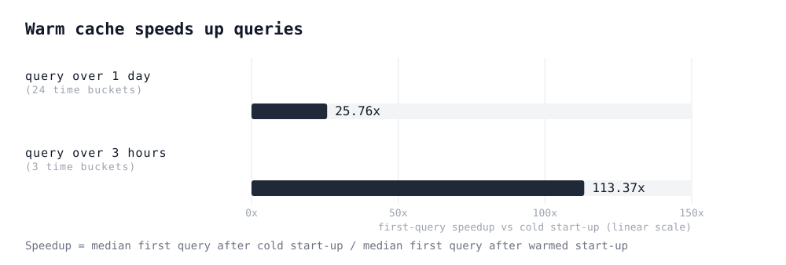
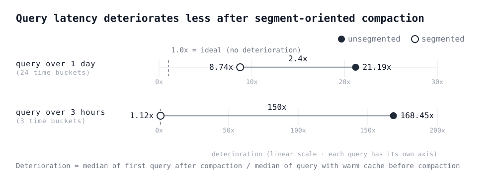
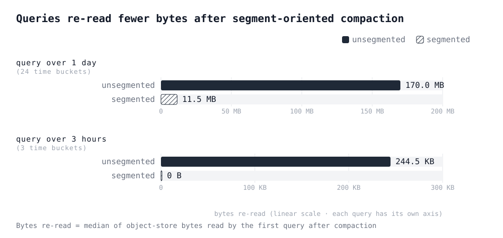

<Tldr>We reduced cold-cache read latencies in OpenData *Timeseries* with two SlateDB improvements: a cache manager that warms the cache after start-up, and segment-oriented compaction that keeps it warm.</Tldr>

Read latencies of object-store-native databases depend significantly on whether the requested data needs to be fetched from object storage or the data is present locally. If the data is cached locally — i.e., the cache is warm — the read latency will be lower. If the data is not present locally — i.e., the cache is cold — the database needs to fetch the data from object storage, which increases the read latency.

To keep read latencies low, an object-store-native database should aim to keep the cache warm. While this is also true for conventional databases based on hard disks or SSDs, a cold cache affects the read latency of object-store-native databases much more since the object-store round-trip latency is between 10ms and 100ms. In contrast, hard disk read latencies are at least one order of magnitude smaller, and SSD read latencies are around three orders of magnitude smaller.

A cache can be cold for a read for various reasons:

- Data might not have been cached yet because it has never been requested since the start of the database.
- Cached data might have been evicted to make space for other data, for example when the cache is full.
- Cached data might be invalid after the database re-organized data in object storage to improve retrieval, for example via a compaction.

One can avoid evictions up to a certain degree by increasing the size of the cache. But what can one do if the cache is empty or its content becomes invalid? We experienced high read latencies due to empty caches and invalid cache content in OpenData's *Timeseries*. This is the story of how we improved *Timeseries* to minimize cold caches during reads.

[OpenData *Timeseries*](https://www.opendata.dev/docs/timeseries) is a Prometheus-compatible timeseries database on object storage. *Timeseries* is built on [SlateDB](https://slatedb.io/) — an embedded object-store-native key-value store based on log-structured merge trees (LSM trees). *Timeseries* addresses the specific use cases of storing and retrieving time series, whereas SlateDB is a general-purpose key-value store that provides fundamental writing and reading capabilities for byte records. Put differently, SlateDB is the common building block that can be used to build object-store-native databases.

Cold caches affect virtually every object-store-native database, not just *Timeseries*. That's why we made the improvements in SlateDB first, where any database built on it can benefit, and integrated them into *Timeseries* afterwards.

## SlateDB fundamentals

To better understand the improvements we added to SlateDB, let's quickly recap some SlateDB fundamentals.

SlateDB stores data in **Sorted String Tables (SSTs)** that are organized into a tree structure (LSM tree). An SST consists of two types of blocks: **data blocks** and **metadata blocks**. The former contain the actual data, the latter contain metadata about the data blocks in the SST. One of the metadata blocks in an SST is the index block that maps keys present in the SST to the data blocks that contain records with those keys.

```
┌SST────────────────────────────────────────────────┐
│                                                   │
│ ┌blk0 (data)──┐  ┌blk1 (data)──┐  ┌blk2 (data)──┐ │
│ │  k1 : v1    │  │  k4 : v4    │  │  k7 : v7    │ │
│ │  k2 : v2    │  │  k5 : v5    │  │  k8 : v8    │ │
│ │  k3 : v3    │  │  k6 : v6    │  │  k9 : v9    │ │
│ └─────────────┘  └─────────────┘  └─────────────┘ │
│        ▲                ▲                ▲        │
│        └─────────────┐  │                │        │
│                      │  │                │        │
│ ┌index (metadata)──┐ │  │                │        │
│ │                  │ │  │                │        │
│ │  k1 ─▶ blk0      ┼─┘  │                │        │
│ │  k4 ─▶ blk1      ┼────┘                │        │
│ │  k7 ─▶ blk2      ┼─────────────────────┘        │
│ └──────────────────┘                              │
│                                                   │
└───────────────────────────────────────────────────┘
```

SlateDB keeps track of the currently active SSTs in the **manifest**. For each active SST, the manifest stores the range of keys it contains.

From time to time, the SSTs in the manifest need to be re-organized for improved retrieval. This process is called **compaction**. During a compaction some SSTs are merged into new SSTs. New SSTs are added to the manifest and old SSTs are removed from the manifest.

SlateDB's **cache** is the local store for metadata and data blocks. Its fundamental unit is the block. The size of the data blocks is configurable (default: 4 KiB), and metadata block sizes depend on the content of the data blocks. Each block can be retrieved from the cache by the ID of the SST it is contained in and its position in the SST.

**Reading a key-value pair** in SlateDB consists roughly of the following steps:

1. Retrieve the IDs of the SSTs that might contain the requested key from the manifest.
2. Look into the cache for the index blocks of the SSTs returned from step 1.
3. If the index blocks are not in the cache, load the index blocks from object storage and put them into the cache.
4. Consult the index blocks to find the data blocks that contain the requested key-value pair.
5. Look into the cache for the data blocks returned in step 4.
6. If the data blocks are not in the cache, load the data blocks from object storage and put them into the cache.
7. Retrieve the requested key-value pair from the data blocks and return it.

## Warm the cache

As we said earlier, one reason a cache can be cold is that data might not have been cached yet because it has never been requested since the start of the database. This kind of cold cache is most noticeable at database start-up when the cache is completely empty. The cache is filled up when blocks are loaded to answer queries. Leaving caches empty after start-up wastes resources and increases the query latencies of the first queries, driving up p90+ latencies.

To efficiently fill up a cache after start-up, we added the [cache manager](https://slatedb.io/rfcs/0023-cache-manager/) to SlateDB (released in [SlateDB 0.13](https://github.com/slatedb/slatedb/releases/tag/v0.13.0)). The cache manager allows loading specific blocks into the cache as well as evicting specific blocks from the cache from outside the read path. That means you can tell SlateDB to load blocks from object storage into the cache without issuing any read request.

Instead of a read request, you specify SSTs whose blocks should be loaded. Additionally, you can specify the type of the blocks, i.e., metadata or data. Directly loading blocks by SST circumvents the read path and its overhead, which includes searching for records and preparing the key-value pairs in the result for reading.

The cache manager can be used in various situations. It can be used to warm up an empty cache during database start-up. For databases with reads that mainly address the most recent data like *Timeseries*, the cache manager can be applied to continuously warm the cache with the most recent data. After a compaction, the cache manager can evict blocks whose SSTs were removed and warm the cache with blocks of the newly created SSTs.

Currently, *Timeseries* uses the cache manager during start-up to warm up its empty cache with recent data. It chooses the SSTs by reading SlateDB's manifest. Users can specify how far back in time to warm the cache with a default of 24 hours. Once the cache is warmed up, read latency drops — at least for the reads that access the blocks in the cache.

## Keep the cache warm

Besides being empty, a cache can be cold because the database invalidated cache content after it reorganized data and metadata in object storage. Specifically for SlateDB, blocks in the cache become invalid if they are involved in compactions.

As mentioned above, during a compaction SSTs are merged into new SSTs and the old SSTs are removed from the manifest. Consequently, blocks in the cache from the old SSTs are invalidated because they are effectively not reachable anymore under the old SST ID. Since the blocks cannot be retrieved from the cache anymore, they need to be fetched from object storage and read latencies increase. If we were able to confine compactions to only a subset of the data, we would be able to avoid at least some of the cache invalidations.

This brings us to the second improvement we added to SlateDB: [segment-oriented compaction](https://slatedb.io/blog/segment-oriented-compaction/) (released in [SlateDB 0.14](https://github.com/slatedb/slatedb/releases/tag/v0.14.0)). Segment-oriented compaction organizes data into segments that are compacted independently. *Timeseries* maps each hourly time bucket to a segment. Because most writes to *Timeseries* land in recent buckets while older buckets rarely change, compactions stay confined to recent segments and leave cached blocks for older data intact.

```
╔═Timeseries═══════════════════════════════════════════════╗
║                                                          ║
║ ┌bucket [09–10)──┐ ┌bucket [10–11)──┐ ┌bucket [11–12)──┐ ║
║ └────────┬───────┘ └────────┬───────┘ └────────┬───────┘ ║
╚══════════╪══════════════════╪══════════════════╪═════════╝
           │                  │                  │
╔═SlateDB══╪══════════════════╪══════════════════╪══════════╗
║          │                  │                  │          ║
╚══════════╪══════════════════╪══════════════════╪══════════╝
           ▼                  ▼                  ▼
┌─Object Storage────────────────────────────────────────────┐
│                                                           │
│ ┌segment [09–10)─┐ ┌segment [10–11)─┐ ┌segment [11–12)──┐ │
│ │  ┌SST┐ ┌SST┐   │ │  ┌SST┐ ┌SST┐   │ │  ┌SST┐ ┌SST┐    │ │
│ │  └───┘ └───┘   │ │  └───┘ └───┘   │ │  └─┬─┘ └─┬─┘    │ │
│ └────────────────┘ └────────────────┘ │    └──┬──┘      │ │
│                                       │       ▼         │◀┼── compaction is
│                                       │    ┌SST─┐       │ │   confined to the
│                                       │    └────┘       │ │   most recent
│                                       └─────────────────┘ │   segment
│                                                           │
└───────────────────────────────────────────────────────────┘
```

## The benefits of a warm cache

To show the benefits of having a warm cache with *Timeseries*, we ran two experiments. In the first experiment we ran queries against:

- *Timeseries* with a cold (i.e., empty) cache,
- *Timeseries* with a warm cache over the last day (i.e., 24 hourly time buckets)

We measured the speed-up of query execution between cold cache and warm cache. We used two queries:

- one wide query over the last day,
- one narrow query over three adjacent hours (i.e., 3 hourly time buckets) in the middle of the last day.

<div class="img-breakout">



</div>

Unsurprisingly, both queries benefit from cache warming with the cache manager. They find all the needed blocks to answer the queries in the local cache. No blocks are read from object storage with a warm cache.

Next, we looked at how segment-oriented compaction confines re-organization to a subset of the data, avoiding unnecessary cache invalidations. In this experiment, we ran queries against:

- *Timeseries* on an unsegmented SlateDB,
- *Timeseries* on a segmented SlateDB

We used the same two queries as in the first experiment.

Each run of the experiment consisted of the following steps:

1. ingest timeseries samples in all time buckets,
2. trigger a full compaction,
3. ingest timeseries samples in the most recent time buckets,
4. execute the query with a warm cache (first measurement),
5. trigger a full compaction,
6. execute the query (second measurement)

The first three steps simulate the data layout in object storage during normal operations: older time buckets are fully compacted and insertions go into the most recent time buckets.

We measured how much the query latency deteriorated between the first and the second measurement.

<div class="img-breakout">



</div>

The latency of the query after compaction (second measurement) deteriorates much less with the segmented SlateDB compared to the unsegmented SlateDB. For the query over one day, the difference in deterioration amounts to 2.4x. For the query over three hours, the difference reaches 150x.

In the segmented *Timeseries* the second compaction is confined to the most recent time buckets. Only cached blocks from those time buckets are invalidated. In the unsegmented *Timeseries* the second compaction affects the entire LSM tree, so cached blocks across many time buckets are invalidated.

To confirm that fewer cached blocks are invalidated, we also measured how many bytes the two *Timeseries* instances need to re-read from object storage to serve the queries.

<div class="img-breakout">



</div>

The result shows that:

- The unsegmented *Timeseries* needs to re-read more samples from object storage for both queries.
- For the query over one day, the segmented *Timeseries* only needs to re-read the blocks for the most recent time buckets that have been compacted and for which the cached blocks were invalidated.
- For the query over three hours, the segmented *Timeseries* does not need to re-read any blocks, because the query only reads samples from time buckets that have not been compacted, and thus no cached blocks are invalidated.

## What's next?

We will continue improving OpenData's *Timeseries*. For example, we will consider using the cache manager for continuously warming the cache and for updating the cache after compactions. Another improvement we are thinking about is to downsample old hourly buckets to daily or larger time buckets so that historical data that does not need high resolution can be fetched faster. Where possible, we will generalize the improvements and add them to SlateDB, so that other object-store-native databases built on SlateDB can leverage them.

OpenData *Timeseries* is MIT-licensed and available today as part of [OpenData](https://github.com/opendata-oss/opendata/). The improvements highlighted in this blog post were released in [*Timeseries* 0.4.0](https://github.com/opendata-oss/opendata/releases/tag/opendata-timeseries%2Fv0.4.0). Since segment-oriented compaction requires changes to the storage layout, existing *Timeseries* deployments cannot be upgraded to this version; a fresh deployment is required.

You can learn more about the design in the [docs](https://www.opendata.dev/docs/timeseries/storage-design), try it through the [quickstart](https://www.opendata.dev/docs/timeseries/quickstart), or join the [Discord](https://discord.com/channels/1450884405219561628/1450884406750216346) if you want to talk through a workload. If you like what you see, consider giving us a star on [GitHub](https://github.com/opendata-oss/opendata/).
