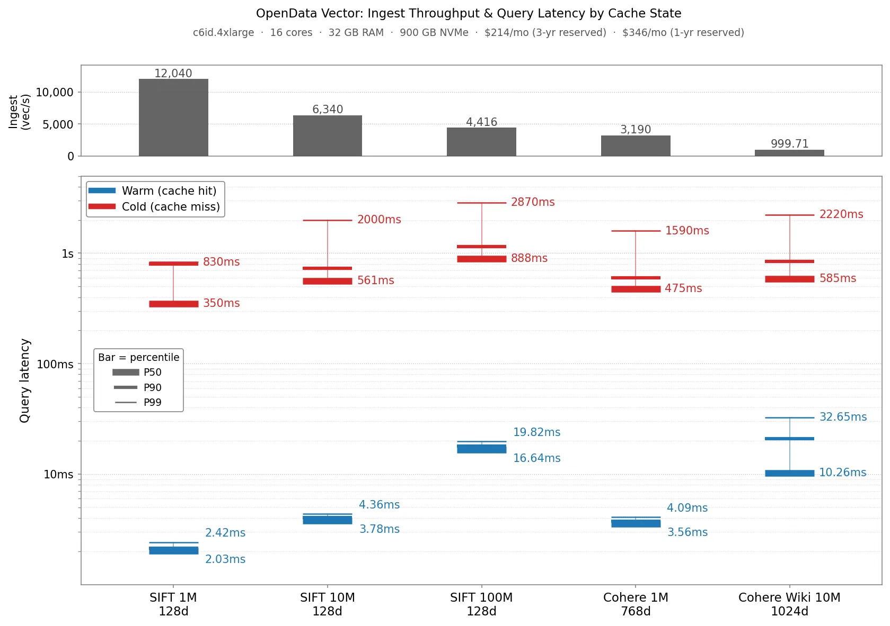

We recently [announced Vector](https://www.opendata.dev/blog/introducing-vector), OpenData's vector search database built on SlateDB. That announcement post detailed Vector's stateless architecture and the resulting operational and cost benefits. We closed with some benchmark results describing Vector's ingest throughput and query latency across a set of standard vector datasets:



The most common follow-up question was "how will it perform and what will it cost me for my own workloads?". So instead of writing another "here are more benchmark numbers" post, we're publishing the benchmark itself so you can answer that question yourself with your own datasets.

The code is at [`vector/bench/`](https://github.com/opendata-oss/opendata/tree/main/vector/bench) in the OpenData repository. The rest of this post explains what the benchmark measures and how you can run it yourself on your own data.

## Vector Bench

The benchmark measures recall, warm and cold query latency, and ingestion throughput for different datasets. It ships with a number of built in datasets, and you can also configure it to run against your own data. See the detailed [README](https://github.com/opendata-oss/opendata/tree/main/vector/bench) for more details on how to run it.

The benchmark runs each dataset through three phases: `INGEST`, `COLD`, `WARM`. Each opens its own fresh `VectorDb` / `VectorDbReader` and tears it down before/after each phase. You configure which phases run via a single config line: `phases = "INGEST,COLD,WARM"` (or any subset).

**INGEST** streams the dataset's base vectors into Vector, reports ingestion throughput as a 5-minute trailing window (sampled every minute), and prints the resulting throughput over the whole ingestion run.

**WARM** opens a `VectorDb`, runs a warmup pass over all queries, then runs the rate-limited concurrent query workload that produces the headline metrics: recall@10, QPS, p50/p90/p99 latency. Concurrency and QPS limit are explicit knobs in the config so you can model the load profile you actually expect. To compute recall, query results are compared against a groundtruth file that stores the actual nearest neighbours of each query vector.

**COLD** opens a `VectorDbReader` with a freshly-allocated, memory-only block cache, runs ten queries, drops the reader and cache, and repeats. The point is to measure what your query performance looks like when every SST block read has to come back from object storage. This is what you would expect to see on a cold node that has not cached the index yet.

The three phases are deliberately separated because Vector's design allows for read and write workloads to be fully decoupled and isolated. So you can capacity plan reads and writes independently.

### Included Datasets

The benchmark supports the following datasets out-of-the-box:

- **SIFT/BIGANN:** SIFT is a goto dataset for benchmarking ANN indexes. It's made up of a billion 128-dimension embeddings that represent features extracted from images. The benchmark includes 100K, 1M, 10M, and 100M subsets that contain the first 100 thousand, 1 million, 10 million, and 100 million vectors from SIFT, respectively.
- **Cohere1M:** A collection of 1 million 768 dimension text embeddings extracted from Wikipedia articles.
- **Cohere10M:** A collection of 10 million 1024 dimension text embeddings extracted from Wikipedia articles.

Each one has a copy-pasteable setup snippet in the [README](https://github.com/opendata-oss/opendata/blob/main/vector/bench/README.md) that downloads the source data, converts it to the bench's `fvecs`/`bvecs` format, and (when needed) generates ground truth locally via the bundled `gen_groundtruth` tool.

### Custom Datasets

You can run the benchmark against your own datasets. The datasets must be in either [fvecs, bvecs](http://corpus-texmex.irisa.fr/), or parquet format. The README provides details about how to configure the benchmark to use your own data, along with some config examples.

### Running The Bencher

The simplest way to start is to try running the 100k-vector SIFT subset that ships in the repo:

```bash
cargo run -p vector-bench --release -- --config vector/bench/sift100k.toml
```

That exercises all three phases against a SlateDB pointed at a local object store and should take ~20 seconds end-to-end on a laptop. This gives you a known good config to extend. Running locally allows you to cheaply sanity check your config changes.

To run against a real object store with a larger dataset, you just need to tweak the config file. For example, to test 10 million SIFT vectors on an S3 bucket, you can use:

```toml
[data.storage]
type = "SlateDb"
path = "vector-bench-run"
settings_path = "/path/to/slatedb.yml"

[data.storage.object_store]
type = "Aws"
region = "us-west-2"
bucket = "my-bench-bucket"

[[params.recall]]
dataset = "sift10m"
data_dir = "/mnt/data"
nprobe = "100"
num_queries = "1000"
num_cold_queries = "1000"
block_cache_disk_bytes = "214748364800"   # 200 GB on local NVMe
block_cache_disk_path = "/mnt/cache/foyer"
phases = "INGEST,WARM,COLD"
```

### Claude Skill

Setting up the configuration for your own datasets can be daunting. To help, we've also included a Claude Skill. You can point it at your raw data, and it'll infer the schema and work with you to set up a configuration to exercise Vector against it:

```bash
% claude
 ▐▛███▜▌   Claude Code v2.1.153
▝▜█████▛▘  Opus 4.7 (1M context) with high effort · Claude Team
  ▘▘ ▝▝    ~/responsive/opendata

  ❯ /vector-bench vector/bench/examples/synthetic-embeddings/embeddings.parquet
  ...
  ⏺ Synthetic parquet: 5000 rows × 64-dim float embeddings, plus category (string) and score (double).
  Single file — Mode C. Footprint is tiny (~1.3 MB raw, well under 10 GB).

  A couple of choices before I write the config:

  ⏺ User answered Claude's questions:
    ⎿  · Which distance metric should I benchmark with? → l2
       · Where should SlateDB store its data? → S3
       · How many rows should I split off as queries? (5000 rows total) → 1000 queries (default)
       · Include category/score as metadata for filtered queries? → No, unfiltered only
  ...
  ⏺ Bench complete. Wrote artifacts to bench-runs/synthetic-embeddings/:

  - recall@10 = 1.0000 on 4K base / 1K query (64-dim, L2)
  - warm p50/p90/p99 = 1.25 / 2.46 / 6.31 ms at 32 QPS (rate-limited)
  - cold p50/p90/p99 = 0.45 / 0.89 / 1.40 ms
  - ingest = 28K vec/s (140 ms total), 38 centroids

  Full writeup, caveats, and reproduction steps in bench-runs/synthetic-embeddings/summary.md.
```

## Caveats

Finally, I want to end with a few caveats. It's still early-days for Vector so there are some limitations worth pointing out:

- **Metadata-filter workloads.** The benchmark supports specifying attribute filters when using custom parquet datasets. However we still haven't built native attribute filtering in our ANN index. Filtering is done after the ANN index yields candidates, so recall may be poor. This is on our near-term roadmap.
- **No deletes or mixed updates.** The ingestion phase just scans through the dataset and ingests vectors. It doesn't support mixing in deletes or updates. You can test updates by re-running ingestion on a db that has already run through the INGEST phase.
- **No mixed read/write.** Phases are sequential; we don't run queries while ingest is in progress. In practice, it's reasonable to capacity plan for ingest and query separately as the architecture allows them to be fully decoupled/isolated.
- **Embedded only.** Currently the benchmark always runs Vector in embedded mode, rather than standing up a Vector server. This is something we plan to add. However, we expect that server overhead will be minimal relative to the cost of indexing on the ingest path and index traversal on the query path, so the numbers should still be representative.

## Next Steps

If you want to try the benchmark for yourself, you can clone the OpenData repository and follow the [quickstart](https://github.com/opendata-oss/opendata/blob/main/vector/bench/README.md#quickstart) in the vector bench project. From there, the README has detailed instructions on how to get it set up with your own datasets and how to configure Vector to achieve good performance. If you do try it out, please join our [Discord](https://discord.gg/2Awkh6YVpP) server. We'd love to hear about your use case and will be standing by to help answer any questions.
